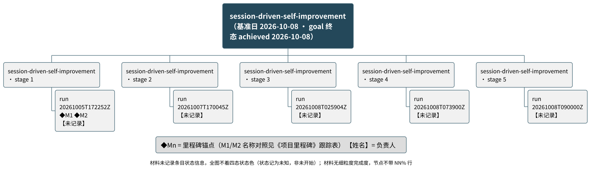

# session-driven-self-improvement 项目总结报告（终版 · goal achieved）

> 本报告是 goal `session-driven-self-improvement` 的 goal 级总结派生物（交付目录 `.specify/goal/session-driven-self-improvement/summary/`），由团队 `session-driven-self-improvement` 的运行事实折叠生成。只读事实源，不修改任何管理工件。**本版为终版刷新（terminal summary on goal met），取代同日早前的过程版总结**；触发边界：goal 已判 `achieved`（create-team § Summary Refresh 门表的 terminal 边界）。

## 项目概览

**背景**：本目标是 Spec Kit 框架内的一个长期目标，定义于 `.specify/goal/session-driven-self-improvement/goal.md`。材料仅记录目标叙述本身，未记录更多立项背景。

> **终态声明（terminal declaration）**：goal 已于 **2026-10-08** 判 **`achieved`**（goal 定义 frontmatter `status: achieved`；`## History`：「2026-10-08 — status active -> achieved.」）。按判据 2 的明文约定，这是一次**刻意的人工判定**（用户收官指令即该判定），不是度量推导的结论；两项判据的满足证据见收官 run 报告 `.specify/teams/session-driven-self-improvement/runs/20261008T090000Z-report.md` § 5。goal 关闭后团队保留为只读，后续 run 指派将被 `run-checks` 拒绝。

**目标**（出处：goal 定义 `## Objective`）：

1. 终态是框架中有一套 improve 流程，具体包含两个方面：主动触发（通过 improve 命令）与被动触发（通过运行判定的结果触发 feedback 流程）。

**范围**（出处：goal 定义 `## Success Criteria`）：

- 界内：一套新的运行判定，统一「token 消耗」「耗时」「正确性」与「满意度」四个量；其中「正确性」只涵盖**制品正确性**（名字级失败集差集为空，且每条返回绿的检查留有红先行取证或变异演练）。
- 界外：「语义正确性」不在本判据内；本目标为长期目标，不设算出的终止判据——achieved 是一次刻意的人工判定，而非由度量得出的结论。

> 材料声明：本目标下只有一个团队（`session-driven-self-improvement`，serial 模式）推进至终态；工作项以「运行（run）」为颗粒从运行报告回填，条目级状态与排期信号未进入记录层（见 `## 元信息` · 材料缺口）。

### 整体进度摘要

**整体完成度：-（无可计数依据）（截至 2026-10-08）**
无排期依据，进度未与计划比对。

| 进度视角 | 当前值 |
|----------|--------|
| 整体完成度 | -（无可计数依据）（口径：无勾选比、无材料明写百分比 → 整体进度无可计数依据，只报状态计数）|
| 工作项分布 | 已完成 0 / 进行中 0 / 未开始 0、状态未知 10（共 10）|
| 里程碑达成 | -（无可计数依据）（逾期 0 个，待达成 0 个，另有无计划日期 2 个）|
| 逾期情况 | 逾期条目 0 项，最长逾期 -（无计划日期，无法判定延期）|

> 材料声明：10 个统计条目（5 个阶段 + 5 个工作项）状态均记为「未知」——材料无状态信号，「未知」表示无从判定，非「未开始」；不以任何冒充无数据的进度数字落笔（无完成度百分比），不上逾期色。**记录层的「未知」与 goal 终态 `achieved` 并行不悖**：前者是条目级状态信号的缺失（见材料缺口），后者是 goal 级的人工判定（见上方终态声明）。

## 需求与特性

> 材料声明：本项目未记录特性清单。已检索：输入表单 `features[]`（空，生成器按团队→项目映射规则未发现能力/交付物类目材料）、团队条目台账（不存在）。因此本节仅保留本声明，不呈现特性表格与特性概览脑图；不把运行产物升格为特性。

## 功能分解



图说：本图呈现该 goal 的功能分解树——5 个阶段（serial 团队的 5 次运行，各含 1 个工作项颗粒），数据截至 2026-10-08。怎么读：材料未记录条目状态信息，全图不着四态状态色（状态记为「未知」，非「未开始」）；材料无细粒度完成度，节点不带 NN% 行；`【未记录】` 为负责人占位（名册存在但未解析到条目）；`◆M1 ◆M2` 表示该工作项的结束点被两个里程碑锚定（名称对照见《项目里程碑》跟踪表）；根节点标注 goal 终态 achieved（2026-10-08，出处见概览终态声明）。结论：5 个工作项状态均为未知，完成度无可计数依据，逾期条目 0 项；5 项均无计划日期、未入甘特图（分解树覆盖：候选全集 5 项，残差清单见 `## 元信息`，覆盖率 5/5 = 100.0%）。

### 工作项进度

**阶段级聚合**

| 阶段 | 状态 | 进度% | 已完成/共计 | 逾期天数 |
|------|------|-------|-------------|----------|
| session-driven-self-improvement · stage 1 | 状态未知 | -（无可计数依据） | -（子项进度未量化，聚合分母 0） | - |
| session-driven-self-improvement · stage 2 | 状态未知 | -（无可计数依据） | -（子项进度未量化，聚合分母 0） | - |
| session-driven-self-improvement · stage 3 | 状态未知 | -（无可计数依据） | -（子项进度未量化，聚合分母 0） | - |
| session-driven-self-improvement · stage 4 | 状态未知 | -（无可计数依据） | -（子项进度未量化，聚合分母 0） | - |
| session-driven-self-improvement · stage 5 | 状态未知 | -（无可计数依据） | -（子项进度未量化，聚合分母 0） | - |

**工作项级**

| ID | 工作项 | 所属阶段 | 状态 | 进度% | 计划起止 | 逾期天数 | 依据 |
|----|--------|----------|------|-------|----------|----------|------|
| session-driven-self-improvement.TIX-3dfddbb0 | run 20261005T172252Z | session-driven-self-improvement · stage 1 | 未知 | -（无可计数依据） | 未排期 | - | 无勾选比/无材料明写百分比 → 进度无可计数依据（不臆造数字）；无计划完成日，无法判定延期 |
| session-driven-self-improvement.TIX-6730c24c | run 20261007T170045Z | session-driven-self-improvement · stage 2 | 未知 | -（无可计数依据） | 未排期 | - | 同上 |
| session-driven-self-improvement.TIX-4e67a199 | run 20261008T025904Z | session-driven-self-improvement · stage 3 | 未知 | -（无可计数依据） | 未排期 | - | 同上 |
| session-driven-self-improvement.TIX-6ccb2680 | run 20261008T073900Z | session-driven-self-improvement · stage 4 | 未知 | -（无可计数依据） | 未排期 | - | 同上 |
| session-driven-self-improvement.TIX-3344086d | run 20261008T090000Z | session-driven-self-improvement · stage 5 | 未知 | -（无可计数依据） | 未排期 | - | 同上 |

本项目无可计数进度依据，仅报状态；阶段聚合排除状态未知的子项，不拖累也不虚增完成率。

### 人员与分工

**人员维度覆盖率：已记录负责人的条目 0 / 全部条目 12（0.0%）**

| 规范名 | 角色 | 负责条目 | 来源 |
|--------|------|----------|------|
| 未记录 | team-supervisor | - | .specify/teams/session-driven-self-improvement/team.md |
| 未记录 | judgment-contract-designer | - | .specify/teams/session-driven-self-improvement/team.md |
| 未记录 | contract-verifier | - | .specify/teams/session-driven-self-improvement/team.md |
| 未记录 | - | PH-0001…PH-0005、TIX-3dfddbb0、TIX-6730c24c、TIX-4e67a199、TIX-6ccb2680、TIX-3344086d、M1、M2 共 12 项 | —（条目级负责人材料缺失） |

> 材料声明：名册 3 行的规范名未解析到 agent 定义（解析顺序 instances → templates 均无对应定义，按规则记 `未记录`，不臆造）；条目级 `owner_id` 全部缺失，故覆盖率为 0/12。团队 7 席（Meta 1 + Worker 5 + 评估 1）中 5 席共用 `agent-stage-executor-template`，名册按 agent slug 归并（§ 2 映射规则），故名册 3 行。

## 项目里程碑

**里程碑进度汇总**

| 指标 | 当前值 |
|------|--------|
| 达成率 | -（无可计数依据） |
| 已达成 / 逾期 / 待达成 | 0 / 0 / 0（共 2，另有无计划日期 2） |
| 最大逾期天数 | - |

| 编号 | 里程碑 | 锚定 | 状态 | 达成进度 | 延期天数 | 负责人 | 依据 |
|------|--------|------|------|----------|----------|--------|------|
| M1 | 一套新的运行判定,统一「token 消耗」「耗时」「正确性」与「满意度」四个量;其中「正确性」只涵盖**制品正确性**( | 未排期（锚定工作项 run 20261005T172252Z，该工作项亦无计划/实际完成日） | 无计划日期，无法判定延期 | -（无可计数依据） | - | 未记录 | 锚定 session-driven-self-improvement.TIX-3dfddbb0 但该工作项无计划/实际完成日，锚定日不可换算；无计划日期（无绝对锚定日、无可换算的锚定工作项），无法判定延期 |
| M2 | 本目标为长期目标,不设算出的终止判据:achieved 是一次刻意的人工判定,而非由度量得出的结论。 | 未排期（锚定工作项同 M1） | 无计划日期，无法判定延期 | -（无可计数依据） | - | 未记录 | 同 M1 |

共 2 个里程碑：已达成 0 个（达成率无可计数依据）、逾期 0 个、待达成 0 个，无计划日期 2 个（无法判定延期）。两个里程碑均来自 goal 定义的判据（出处：`.specify/goal/session-driven-self-improvement/goal.md`），锚定到同一工作项；因锚定工作项无完成日期，锚定日不可换算，故不作出带日期菱形的里程碑视图，也无甘特图可合并呈现——里程碑图元本次不出图。

> **判定边界（终版如实声明）**：goal 级终态为 `achieved`（2026-10-08，人工判定——见概览终态声明），但记录层两行里程碑仍为「无计划日期」。二者不矛盾：记录层的里程碑状态由引擎按**日期证据**判定（`actual_date` / `achieved_evidence`），而表单生成器按映射规范只折叠判据文本与出处，goal frontmatter 的 `status: achieved` 不在其映射输入内——为本报告诚实补上这一缺口的是概览终态声明与 `## 元信息` · 阶段级推进事实（出处均可溯源），而非把记录层状态手工改判为 `achieved`（引擎判定的状态不手工改写）。

## 任务进展

> 材料声明：表单未提供任何计划/实际日期与工期字段（全部工作项的 planned_start/planned_end 均为空，也无进度文档可摄取，repo 取材未声明）。因此不呈现甘特图与 today 参照线；下方以任务状态表与整体状态叙述替代，任务分解复用《功能分解》的 WBS（见上图）。

| 工作项 | 来源 | 状态 |
|--------|------|------|
| run 20261005T172252Z | .specify/teams/session-driven-self-improvement/runs/20261005T172252Z-report.md | 未知 |
| run 20261007T170045Z | .specify/teams/session-driven-self-improvement/runs/20261007T170045Z-report.md | 未知 |
| run 20261008T025904Z | .specify/teams/session-driven-self-improvement/runs/20261008T025904Z-report.md | 未知 |
| run 20261008T073900Z | .specify/teams/session-driven-self-improvement/runs/20261008T073900Z-report.md | 未知 |
| run 20261008T090000Z | .specify/teams/session-driven-self-improvement/runs/20261008T090000Z-report.md | 未知 |

### 进度叙述

**整体**：截至 2026-10-08，整体完成度 -（无可计数依据）（口径：无勾选比、无材料明写百分比 → 整体进度无可计数依据，只报状态计数）；无排期依据，进度未与计划比对；当前处于 goal 终态（achieved，2026-10-08——链上五阶段全部完成并通过独立验证，无后续阶段）。

| 阶段 | 起止 | 状态 | 进度% | 逾期天数 |
|------|------|------|-------|----------|
| session-driven-self-improvement · stage 1 | 未排期 | 状态未知 | -（无可计数依据） | - |
| session-driven-self-improvement · stage 2 | 未排期 | 状态未知 | -（无可计数依据） | - |
| session-driven-self-improvement · stage 3 | 未排期 | 状态未知 | -（无可计数依据） | - |
| session-driven-self-improvement · stage 4 | 未排期 | 状态未知 | -（无可计数依据） | - |
| session-driven-self-improvement · stage 5 | 未排期 | 状态未知 | -（无可计数依据） | - |

**完成度分布**：已完成 0 项、进行中 0 项、未开始 0 项、状态未知 10 项（共 10）。
**逾期**：逾期条目 0 项，最长逾期 -；无计划日期条目 10 项，无法判定延期（不上逾期色）。

## 元信息

- 生成日期：2026-10-08（= 基准日 D0，逐字传给引擎 `--baseline`）
- **刷新性质：终版刷新（terminal summary on goal met）**——goal 已判 `achieved`（2026-10-08），按 create-team § Summary Refresh 门表的 terminal 边界出本次总结；本版**取代**同日早前的过程版（3 阶段 / 3 条目，止于 S4 累积 1/2 落地时点）。门序 Budget → Cadence → Material → Overlap：Budget 通过（无 kill-switch，非 report-only tier）；terminal 边界优先于 cadence；Material 通过（台账不存在但 `runs/` 有 5 份 `-report.md` 交付物）；Overlap 通过（仅 1 个团队声明本 goal_slug，无争用）。
- **Summary: produced**（交付目录 `.specify/goal/session-driven-self-improvement/summary/`）；**Overlap: none**。
- **goal 终态声明**：`status: achieved`（`.specify/goal/session-driven-self-improvement/goal.md` frontmatter；`## History`「2026-10-08 — status active -> achieved.」；经 goal 唯一作者入口 `goal-utils.py status --set achieved` 落盘）。判定性质：刻意的人工判定（判据 2 明文约定），用户收官指令即该判定。两项判据的满足证据：收官 run 报告 § 5（判据 1——引擎 `AXES` 四轴、正确性只做制品正确性（名字级 A/B 差集 + 红先行/变异）、`not-evaluated` 绝不报 ok、红先行取证经本 session 7 轮全量 A/B 实跑；判据 2——该人工判定本身）。
- 调用方式：**非交互模式**（团队触发为自动流程，按 create-team 映射规范以 `--load` 每次从台账/报告重建）；四道呈现门禁（概览 / 里程碑 / WBS / 甘特）**未经交互确认**，自动通过。
- 输入信息源：S-0001 `user-form` → `.specify/teams/session-driven-self-improvement/`（covers：work_items / phases / people）；goal 叙述与判据 ← `.specify/goal/session-driven-self-improvement/goal.md`（goal_source: definition，显式 goal 身份）。
- 表单校验：`python3 skills/summarize-project/scripts/validate-project-input.py --input data/project-input.yaml --json` → status=ready，R 档齐备，无阻断（报告存 `data/input-validation.json`）。
- 推断字段清单：
  - `people[*].owner_name ← 未记录`（3 条：名册引用的 agent 定义未找到，按 FR-004 记未记录）——表单生成器留痕
  - `work_items[*.TIX-*].item_id ← 标题+阶段哈希`（5 条：台账发放显式 ID 之前的历史条目，FR-027 推断身份）——表单生成器留痕
  - `work_items[*].status ← 未知`（缺失且无勾选计数 → 状态记未知，非 not-started）、`work_items[*].depends_on ← 无依赖虚线`（不虚构依赖）、`milestones[*].status ← 引擎按锚定日判定`——装载校验器留痕
  - `phases[*].source ← .specify/teams/session-driven-self-improvement/（user-form）`（5 条：条目未写来源，按 sources[] 声明推断）——引擎留痕
- 项目数据库：`python3 skills/summarize-project/scripts/project-db.py --db data/project.db --load data/project-input.yaml`（schema 版本 project-db/v1；装载即校验 + `--check` 体检 ok；非 `--update` 模式——每次刷新由表单重建，累积权威在团队台账；删除交付目录后重跑得同一份总结）。
- 进度引擎运行：`python3 skills/summarize-project/scripts/progress-engine.py --db data/project.db --baseline 2026-10-08 --out data/engine-out.json`（退出码 0）；本报告全部状态/进度/延期/覆盖数字出自该次运行；数据库与引擎输出为派生产物，落交付目录 `data/`，未写入目标项目管理工件。
- 渲染状态：wbs | ok（draw-plantuml 渲染，SVG+PNG 同名配对；版面量测通过）。特性概览脑图不出图（特性行数 0 < 8，且无分组材料）；里程碑视图不出图（2 个里程碑均无计划日期，无带日期菱形可画，且未达独立成图阈值）；甘特不出图（引擎判 `gantt_recommended=false`，`bar_count=0`）。
- 估计假设：无。

### 统计口径

| 口径 ID | 指标定义（字段） | 采集命令 | 范围 | 采集日 |
|---------|------------------|----------|------|--------|
| SC-1 | 整体完成度 `project.progress.progress_pct` / `project.progress.formula` / `basis` | progress-engine.py（见上） | goal 聚合（1 团队） | 2026-10-08 |
| SC-2 | 状态分布 `project.status_counts` | 同上 | 同上 | 2026-10-08 |
| SC-3 | 条目计数 `project.counts.{items,work_items,leaves,milestones}` | 同上 | 同上 | 2026-10-08 |
| SC-4 | 里程碑汇总 `milestones.counts` / `achieved_*` / `narrative` | 同上 | 同上 | 2026-10-08 |
| SC-5 | 逾期 `project.counts.delayed` / `project.delay_days_max` / `items[].delay_days` | 同上 | 同上 | 2026-10-08 |
| SC-6 | 阶段聚合 `groups[].{status,progress_pct,aggregation}` | 同上 | 同上 | 2026-10-08 |
| SC-7 | 人员覆盖率 `people.coverage_formula` / `people.roster` | 同上 | 同上 | 2026-10-08 |
| SC-8 | 覆盖闭合 `coverage.{closure_equation,closure_ok,coverage_formula,progress_denominator_set}` | 同上 | 同上 | 2026-10-08 |
| SC-9 | 甘特判据 `gantt.schedule_material.{has_planned_dates,gantt_recommended,reason}` / `bar_count` | 同上 | 同上 | 2026-10-08 |

### 状态映射

- 本次实际使用的映射：表单 `status` 为空字面量 → 引擎记 `unknown`（状态缺失 ≠ not-started）；无其他源状态字面量。
- 未映射字面量清单：无（引擎 `diagnostics.unmapped_statuses` 为空）。
- 记录未闭合项清单：无。

### 进度数据来源

- 基准日 D0：2026-10-08（与生成日期一致；取值 = 台账/报告回填条目的最新时间戳，非系统时钟）
- 引擎调用：`python3 skills/summarize-project/scripts/progress-engine.py --db data/project.db --baseline 2026-10-08 --out data/engine-out.json`
- 本次生效阈值：weak_git_commits=10、weak_git_span_days=7、milestone_view_min_count=4、milestone_view_min_span_days=61、gantt_split_bars=20（阈值只存于引擎，此处登记本次取值；报告正文不出现）
- 分母口径：无勾选比、无材料明写百分比 → 整体进度无可计数依据，只报状态计数 + 团队条目台账 items.jsonl（5 项，已扣除剔除项 0）（与分解树覆盖范围一致）
- 未量化条目：10 项（已在各章以 `-（无可计数依据）` 呈现）
- 字段 → 呈现位对照：`project.progress.progress_pct` → 项目概览摘要/任务进展叙述/WBS 图说；`project.status_counts` → 概览分布行/任务进展分布句；`groups[].progress_pct` → 功能分解阶段行/任务进展阶段表；`milestones.counts` → 概览达成行/里程碑汇总表/达成叙述；`project.counts.delayed` → 概览逾期行/任务进展逾期句；`people.coverage_formula` → 人员与分工首句；`coverage.*` → 分解树覆盖声明

### 分解树覆盖

```text
分解树覆盖：候选全集 C = 团队条目台账 items.jsonl（5）
残差清单 R：R-未排期 5（5 个工作项均无计划日期，未入甘特，已入 WBS 与记录表）、R-未归属 0、R-已剔除 0（无剔除）、R-粒度截断 0
覆盖闭合：5 − 0 − 0 = 5（= 分解树工作项数 = 进度分母集合大小）
覆盖率：5/5 = 100.0%
进度分母集合：团队条目台账 items.jsonl（5 项，已扣除剔除项 0）
```

### 材料缺口

| 缺什么 | 已检索来源 | 报告影响（不存在/降级的内容）|
|--------|-----------|------------------------------|
| 显式条目台账（`items.jsonl`）| `.specify/teams/session-driven-self-improvement/items.jsonl`（不存在）；`runs/` 下 5 份 `-report.md`（已按映射规则折叠回填）| 工作项为运行级颗粒、身份为推断形（TIX-*）；台账启用后刷新将改用显式身份（本 goal 已终态、团队转只读，预期不再有后续刷新，落差由阶段级推进事实显式承载） |
| 条目级状态信号 | 上述台账（无）；5 份运行报告的 `**Outcome**` 字段（首份为 halted at preview、其余 4 份无该字段，生成器逐份声明缺失，状态记 unknown 而非猜测）| 全部条目与阶段状态记「未知」：全图不着四态色、无状态图例行；「未知」非「未开始」 |
| 计划/实际日期与工期 | 表单 planned_*/actual_* 全空（生成器仅折叠交付物行）；迭代/排期文档未提供 | 甘特不出图、里程碑视图不出图；10 个条目 + 2 个里程碑全部 `unknown-schedule`，「无计划日期，无法判定延期」，不上红、不计逾期 |
| 进度百分比 | 表单 checks / progress_pct 全空；运行报告内无可折算计数 | 全部进度呈现位写 `-（无可计数依据）`；无整体完成度、无达成率 |
| 条目级负责人 | people[] 名册 3 行（agent 定义在 instances/templates 均未解析 → `未记录`）；条目 owner_id 全空 | 覆盖率 0/12 = 0.0%；WBS 全部 `【未记录】` |
| 特性清单 | features[]（空）；团队能力/交付物类目材料（无）| 《需求与特性》仅保留声明，不出表格与脑图 |
| 里程碑计划日期 | goal 定义判据无日期；锚定工作项亦无完成日 | 里程碑不出带日期菱形图元；达成率无可计数依据 |
| goal 终态进记录层 | goal frontmatter `status: achieved`（goal-utils.py 引擎拥有，goal 唯一作者入口落盘）；表单生成器的映射输入不含 goal 状态字段，里程碑行亦无 `actual_date` / `achieved_evidence` 可折叠 | 记录层里程碑保持「无计划日期」；goal 终态由本报告以带出处的声明承载（概览终态声明 + 元信息终态声明 + 阶段级推进事实），不改判引擎状态。如需映射层承载 goal 终态，属生成器映射规则的修订项，不在本报告内补写 |
| 内联 goal 与定义的字面一致（FR-012） | 团队 `team.md` 内联 `goal:` 渲染文本与定义 `## Objective` 字面不一致 | 以定义为权威（FR-012）；差异为团队视角渲染文本长于定义叙述，无实质冲突 |

阶段级推进事实（供读者溯源，未折算为记录层状态；**本节为终版**，取代过程版的同名段落）：serial 链五阶段全部完成——S1 运行判定契约完成（`runs/2026-10-06-S1-judgment-contract.md`）；S2 运行判定引擎落地（`scripts/python/run-determination.py` + 契约测试）；S3b 批评与自我批评概念双文档落地（`docs/concepts/critique-and-self-critique.md` + `shared/guidelines/critique-and-self-critique.md` + SI-3C 归口）；S3 被动触发接线落地（`shared/workflow/feedback-step.md` § Run Determination + instructions 模板 `## Run Determination` ambient 小节 + live 注入 + 2 支契约测试；出处：收官 run 报告 § 2）；S4 主动触发落地（命令薄壳 `templates/commands/improve.md` why → what → how + 技能侧 `skills/self-improvement/SKILL.md`；出处：收官 run 报告 § 3）；S5 独立验证**两轮全 PASS**（`runs/20261008T070532Z-verification.md`、`runs/20261008T084144Z-verification.md`）；goal 于 2026-10-08 判 `achieved`（人工判定，证据见元信息终态声明）。以上出处路径均相对 `.specify/teams/session-driven-self-improvement/`。这些事实与记录层「全部未知」的落差，正是台账（`items.jsonl`）尚未发放显式条目身份所致——goal 已终态、团队转只读，该落差由本声明显式承载而非回填臆造。
