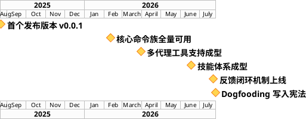
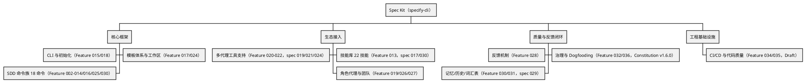
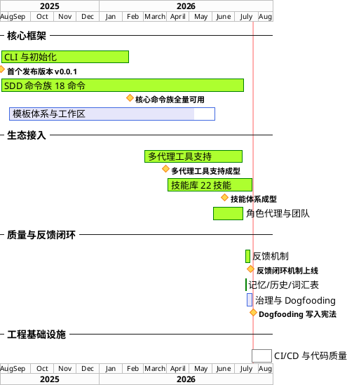

# Spec Kit 项目管理文档

> 本文档由 `manage-project` 技能于 2026-07-25 建立（dogfooding 历史基线）；该技能已重构为 `visualize-project`（只读呈现工具），本文档现作为其可视化的信息源之一，不再由技能维护。
> 原定位：单一事实源——四要素（背景 / 里程碑 / 主要工作 / 进度）全部在本文档内维护；图表以 PlantUML 源码嵌入，源码是权威形态，渲染图片仅为派生产物。

## 项目背景

**Spec Kit**（发行名 `specify-cli`）是一个规格驱动开发（Spec-Driven Development, SDD）CLI 工具箱：通过模板与脚本在目标项目中生成 `.specify/` 工作区和指令文件，驱动 `/speckit.*` 命令族完成"需求 → 澄清 → 计划 → 任务 → 实现 → 评审"的完整开发生命周期。

- **目标**：让 AI 编码代理在任何项目中以规格为单一事实源进行受控开发，并通过反馈闭环（Feedback / Memory / History / Review）持续改进框架自身与下游项目。
- **干系人**：框架维护者（本仓库开发者）、下游项目开发者（安装 `specify-cli` 的用户）、8 个受支持的 AI 编码代理工具链（Tier 1：Claude Code、Codex CLI、Qoder CLI、GitHub Copilot、opencode；Tier 2：Qwen Code、Hermes Agent、iFlow CLI）。
- **范围**：CLI 实现（`src/specify_cli/`）、模板体系（`templates/`）、命令提示词（`/speckit.*` 18 个命令）、技能库（`skills/` 22 个）、代理定义（`agents/`）、脚本自动化（`scripts/`）、项目记忆与治理（`.specify/memory/`，含 Constitution v1.6.0 十一原则）。
- **开发方式**：项目自身即以 SDD 流程开发（Constitution 原则 XI Dogfooding），截至 2026-07-25 已完成 28 个规格迭代（001–032，含归档）、753 次提交、125 个发布标签（最新 v0.14.1）。

## 项目里程碑

里程碑取自 git 标签、Feature 索引（`.specify/memory/features.md`）与规格迭代记录中的关键节点。达成状态：achieved（已达成）/ pending（未达成）/ at-risk（有风险）。

| 里程碑 | 锚定 | 状态 |
|--------|------|------|
| 首个发布版本 v0.0.1 | 2025-08-22（git 标签） | achieved |
| 核心命令族全量可用 | 2026-02-10（Feature 002–015 标记 Completed） | achieved |
| 多代理工具支持成型（8 工具双梯队） | 2026-03-30 起至 spec 019/021/024 收敛 | achieved |
| 技能体系成型（22 技能 + 三大整合迭代） | 2026-06 spec 017 完成草稿技能整合 | achieved |
| 反馈闭环机制上线（Feature 028） | 2026-07-22（spec 027 处理侧完成） | achieved |
| Dogfooding 写入宪法（原则 XI，v1.6.0） | 2026-07-25（spec 032 实现） | achieved |
| Feature 036 人工验收（Ready for Review → Completed） | 待人工评审（关联"Dogfooding 实践落地"结束点） | pending |
| 测试债清零维护迭代立项（106F/13E 基线债务） | 待 `/speckit.requirements` 立项（评审报告 F7 建议） | pending |

图注：里程碑视图只呈现零工期关键节点（菱形），回答"项目走到了哪一步"。两个 pending 里程碑（Feature 036 人工验收、测试债维护迭代立项）尚无确定日期，故仅在上方跟踪表格中登记，待锚定后补入图中。

## 主要工作

单一工作分解树：阶段 → 任务两级，共 4 个阶段、10 个任务包。每个任务包均可溯源到 Feature 索引或规格迭代（括号内为来源）。

图注：WBS 回答"项目由哪些工作组成"。前三个阶段为已交付/接近交付的主体能力；「工程基础设施」阶段（CI/CD、代码质量工具）仍处 Draft，是当前主要未启动工作。

## 进度追踪

进度甘特图覆盖有时间信息的任务包，三态语义：completed（绿色，100%）/ in-progress（蓝色，带百分比）/ not-started（灰色，0%）；6 个已达成里程碑以菱形嵌入对应阶段，与「项目里程碑」节同名同锚定。百分比推断依据见图注。

图注与状态推断依据：

- **completed（100%，绿色）**：来源材料明确标记 Completed/Implemented——核心命令族（Feature 002–015 于 2026-02-10 标记 Completed）、多代理工具支持（spec 024 于 2026-07-12 收敛）、技能库（spec 030 完成 + 2026-07-25 manage-project 进化落地）、角色代理与团队（spec 023/026 归档实现）、反馈机制（Feature 028，2026-07-22）、记忆/历史/词汇表（Feature 030/031，2026-07-14/16）。
- **in-progress（蓝色，带百分比）**：模板体系与工作区 90%（Feature 017 Completed，但 Feature 023 模板质量校验、024 工作区版本化仍为 Draft）；治理与 Dogfooding 90%（宪法原则 XI 已落地，Feature 036 尚待人工验收 Ready for Review → Completed）。
- **not-started（灰色，0%）**：CI/CD 与代码质量（Feature 034/035 均为 Draft，2026-07-22 登记）；其 30 天工期为估计假设（见元信息）。
- **当前日期参照线**：红色竖线（`today`）标于 2026-07-25，落在「治理与 Dogfooding」尾部与「CI/CD 与代码质量」起步区间，直观呈现"主体能力已交付、工程基础设施待启动"的现状。

## 迭代记录

敏捷循环日志：每迭代一行，登记 需求 → 特性 → 任务/负责人 → 测试用例 → 评估 的锚点与结论（来源当前均为本地工件）。

| 迭代 | 周期 | 需求 | 特性 | 任务/负责人 | 测试用例 | 评估 |
|------|------|------|------|-------------|----------|------|
| 1 | 2026-07-25 | `.specify/specs/032-dogfooding-practice/requirements.md` | Feature 036 Dogfooding Practice | `.specify/specs/032-dogfooding-practice/tasks.md`（17 任务；负责人：框架维护者） | `tests/contract/test_dogfooding_practice.py` 19 passed；`verification.md` SC-001…004 pass | `review.md` 0P0/3P1/4P2；评审+反馈已消费入框架（6 项修复）；下一轮输入：F7 测试债维护迭代立项 |

## 元信息

- 最后更新：2026-07-25
- 本次变更摘要：初始化管理文档（首次以 manage-project 技能对 Spec Kit 自身建立四要素管理基线）；按用户指令将项目管理根目录定为 `.specify/project/`；按技能升级后的骨架补齐 `## 迭代记录` 节并登记迭代 1（spec 032 Dogfooding 循环）。
- 估计假设：
  1. 假设：「CI/CD 与代码质量」工期估计为 30 天（Feature 034/035 为 Draft，材料未提供排期）。
  2. 假设：「模板体系与工作区」起点取 2025-09-01（模板体系随早期版本渐进成型，材料未提供精确启动日；终点取 Feature 023/024 登记日 2026-06-05）。
  3. 假设：各任务包起止日期以 Feature 索引「Last Updated」与规格迭代完成记录为锚点，实际开发起点可能早于所引锚点。
  4. 假设：进度百分比按 Feature 状态（Completed/Implemented=100，含 Draft 子项的阶段按已完成子项占比估 90，Draft=0）推断，非工时统计。
