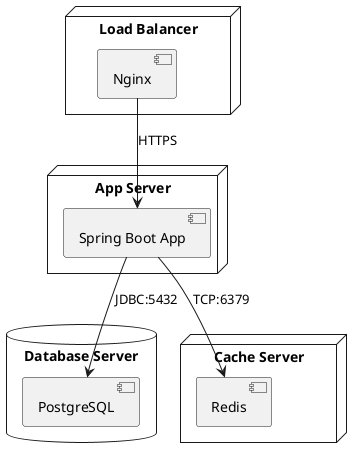
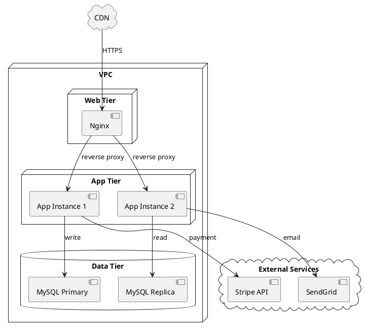
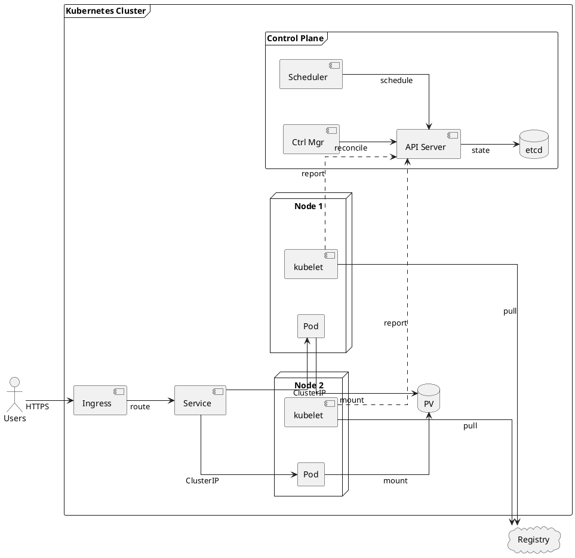
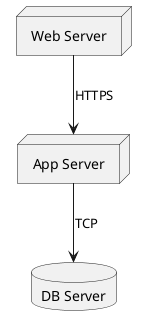
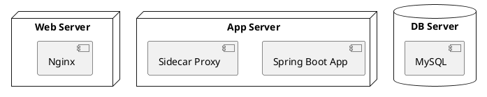
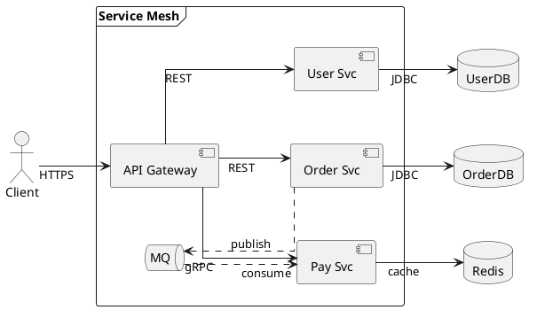
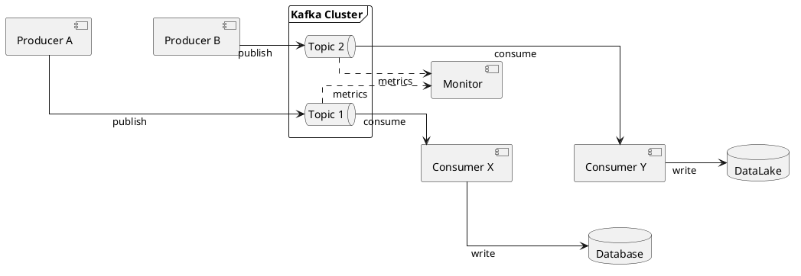
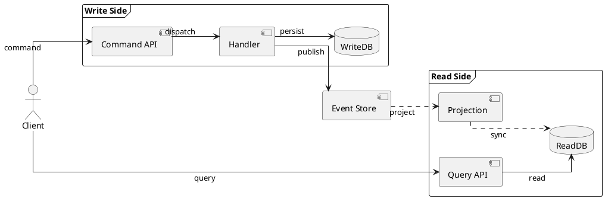

# 如何画部署图 (Deployment Diagram)

> 部署图展示系统的物理运行时拓扑——软件制品部署在哪些节点上，节点之间如何通信。是运维、DevOps 和基础设施规划的核心图表。

## 部署图的用途

部署图回答的是"系统运行在哪些机器上，它们之间如何连接"：
- 描述服务器、容器、云资源的物理/虚拟拓扑
- 展示软件组件与硬件节点的映射关系
- 规划网络通信路径和协议
- 为容量规划、灾备设计提供可视化参考
- Kubernetes 集群、云原生架构的标配文档

## 关键元素

| 元素 | PlantUML 表示 | 说明 |
|------|-------------|------|
| **节点 (Node)** | `node "名称" {}` | 物理/虚拟机、容器 Pod、云实例 |
| **制品 (Artifact)** | `[名称]` | 部署在节点上的软件（JAR、WAR、Docker 镜像） |
| **数据库 (Database)** | `database "名称"` | 数据库实例的特殊节点 |
| **云 (Cloud)** | `cloud "名称"` | 云服务或外部系统的抽象 |
| **通信路径** | `A --> B : 协议` | 节点之间的网络连接和协议 |
| **嵌套节点** | 盒子套盒子 | 容器/执行环境的层次关系 |
| **集合 (Collections)** | `collections "名称"` | 多个同类节点组成的集合 |
| **帧 (Frame)** | `frame "名称" {}` | 逻辑分组，如命名空间、VPC、区域 |

## PlantUML 语法

### 基本部署图

### 带云服务的部署图

### Kubernetes 部署图

> 基础设施视角：展示 K8s 核心组件（Control Plane、kubelet、Service、PV）及其交互，
> 而非应用业务逻辑。kubelet 负责从 Registry 拉取镜像并管理 Pod 生命周期。
> 注意区分集群级资源（Node、PV）和命名空间级资源（Service、Pod、ConfigMap、PVC）。

**要点说明**：
- **语义驱动布局**：先分析组件角色（Hub/Edge/Peer/Entry/Sink），再确定空间位置。API Server 是 Hub（中心端），kubelet 是 Edge（节点端），1:N 关系形成"控制面在上、节点在下"
- **`together{}`**：对等组件并排放置 — Scheduler + Ctrl Mgr（压缩控制面宽度），Node 1 + Node 2（体现 1:N 语义）
- **隐藏连线 `[hidden]`**：`api -[hidden]d-> n1` 强制控制面在节点上方，`pv -[hidden]d-> reg` 对齐存储与外部服务。不显示线条但控制布局
- **虚线区分控制信号**：`..>` 用于 kubelet→API Server 的 report（周期性控制信号），`-->` 用于数据流和强依赖，一眼可区分流量路径和管理通道
- **`linetype ortho` + 大间距**：正交布线配合 `nodesep ≥ 60`、`ranksep ≥ 80`，避免直角线段重叠
- **箭头按语义分组**：先写流量链路，再写中心端内部，然后控制信号，最后资源拉取和存储，代码结构映射架构语义

## 部署图层次：从简到详

### 层次 1：宏观拓扑（节点级）

只展示节点和通信协议，适合架构评审：

### 层次 2：容器级拓扑

展示每个节点上运行的软件：

### 层次 3：完整云原生拓扑

展示命名空间、Pod、StatefulSet、外部服务等全部细节（见上方 Kubernetes 部署图）。

## 常见部署拓扑模式

| 模式 | 描述 | 适用场景 |
|------|------|---------|
| **单节点** | 所有服务部署在一台机器 | 开发/测试环境 |
| **分层部署** | Web / App / DB 分层部署 | 中小型应用 |
| **多实例 + 负载均衡** | 多台 App Server + LB | 高可用 Web 应用 |
| **主从数据库** | Primary + Replica | 读写分离、灾备 |
| **K8s 集群** | Pod + Service + StatefulSet | 云原生、微服务 |
| **多云/混合云** | 跨云供应商或跨区域 | 灾备、合规 |

## 常见架构模式模板

以下三个模板遵循与上方 Kubernetes 示例相同的规范：语义布局注释、隐藏连线控制排列、虚线区分异步/控制信号、`together{}` 对等分组、`linetype ortho` 正交布线，以及要点说明。

### 模式 1：微服务架构 (Microservices)

Hub=API Gateway 统一路由，多个微服务通过 Service Mesh 协同工作，同步调用与异步消息并存。

**要点说明**：
- Hub=API Gateway 是所有流量的入口路由，Edge=各微服务通过 `together{}` 并排
- `..>` 虚线表示异步消息（发布/消费），`-->` 实线表示同步调用（REST/gRPC）
- `queue "MQ"` 使用队列图形表示消息中间件
- 隐藏连线 `gw -[hidden]d-> order` 确保网关在服务上方

### 模式 2：消息队列架构 (Message Queue)

管道式流向：多个 Producer 发布消息到 Kafka Broker，多个 Consumer 消费并写入终端存储。

**要点说明**：
- 生产者和消费者各用 `together{}` 并排，体现 N:N 对等关系
- Hub=Kafka Cluster 使用 `queue` 图形，清晰表达消息中间件语义
- `..>` 虚线用于监控/指标上报，`-->` 实线用于消息发布和消费
- 管道式流向：Producer → Broker → Consumer → Sink

### 模式 3：CQRS 架构 (Command Query Responsibility Segregation)

写入端和读取端分离，Event Store 作为中枢桥接两侧，异步投影保持读模型最终一致。

**要点说明**：
- 用 `frame "Write Side"` 和 `frame "Read Side"` 划分两侧，CQRS 的核心分离一目了然
- Hub=Event Store 连接写入端和读取端，是架构的中枢
- `..>` 虚线表示异步投影（Event → Projection → ReadDB），`-->` 实线表示同步操作
- 客户端同时连接 Command API（写）和 Query API（读），体现 CQRS 的双入口语义

## 部署图建模步骤

1. **识别物理/虚拟节点**：有哪些服务器、容器、云资源？
2. **确定节点上的软件**：每个节点运行什么软件制品？
3. **绘制嵌套层次**：集群 → 命名空间 → Pod → 容器
4. **标注通信路径**：节点间用什么协议通信？（HTTPS、JDBC、gRPC、TCP）
5. **标注端口**：关键端口号（3306、6379、8080）
6. **区分内部/外部**：用 `cloud` 表示外部依赖，`node` 表示内部节点

## 最佳实践

- **从宏观到微观**：先画出高层拓扑（Web/App/DB），再逐步细化容器和实例
- **协议要标注清楚**：简单的 `HTTPS`、`JDBC`、`gRPC` 标签让图自解释
- **使用嵌套节点表达层次**：K8s Cluster → Namespace → Pod → Container
- **区分实例数量**：标注 `(x3)` 表示多个实例
- **外部服务用 cloud**：避免混淆内部和外部依赖
- **物理和逻辑分开**：部署图聚焦物理拓扑，不要混入组件交互细节（交给时序图）
- **节点数量控制在 10 个以内**：超过则拆细（先概览拓扑，再逐个子系统深入）
- **K8s/云原生部署图用语义驱动布局**：先分析组件角色（Hub/Edge/Peer/Entry/Sink），由语义关系决定空间位置。使用 `left to right direction` + `frame` 分组 + `together {}` 对等节点并排 + `linetype ortho` 正交布线，按语义分组箭头（流量链路、中心端内部、跨层连接），使代码结构反映架构语义

## 与组件图的区别

| 维度 | 组件图 | 部署图 |
|------|-------|--------|
| 关注点 | 逻辑结构：系统由哪些软件组件组成 | 物理拓扑：组件运行在哪些节点上 |
| 元素 | component、interface、package | node、database、cloud、artifact |
| 表达内容 | 组件间依赖和接口契约 | 节点间网络连接和部署位置 |
| 受众 | 开发人员、架构师 | 运维、DevOps、架构师 |
| 典型问题 | "Order Service 依赖哪些服务？" | "Order Service 部署在哪个集群的哪个 Pod？" |
