# PlantUML 绘图最佳实践

通过规范代码结构、合理控制布局、统一视觉样式和模块化组织内容，使生成的 UML 图逻辑清晰、层次分明且视觉友好。

> **定位**：本文件是绘图**质量提升指南**，与 [plantuml-style.md](./plantuml-style.md)（统一样式配置）和 [plantuml-guide.md](./plantuml-guide.md)（语法参考）互补。在 Step 3 草拟 PlantUML 代码时**必须参照本实践**。

---

## 一、布局优化

> 80% 的可读性问题源于元素位置混乱，**布局控制优先于样式美化**。

### 1.1 方向控制

用方向关键字明确连接线走向，避免自动布局导致的交叉：

```plantuml
' 强制方向指令（适用于所有关系线）
A -right-> B : 向右
A -down-> C : 向下
A -left-> D : 向左

' 缩写形式同样有效
A -r-> B
A -d-> C
A -l-> D
```

**核心原则**：
- 时序图：核心服务置左，辅助系统置右，**数据流从左到右**
- 组件图/部署图：主要依赖从上到下（配合 `top to bottom direction`）
- 活动图：主干流程垂直向下，分支水平展开

### 1.2 隐藏连接线引导布局

通过 `-[hidden]->` 创建不可见连接，间接调整元素相对位置：

```plantuml
' 使 ServiceB 位于 ServiceA 右侧，但不显示连线
ServiceA -[hidden]right-> ServiceB

' 利用隐藏线构建网格布局
A -[hidden]-> B
A -[hidden]-> C
B -[hidden]-> D
```

### 1.3 分组与逻辑分区

#### `together{}` 绑定关联元素

```plantuml
' 认证模块紧密排列，不被自动布局分散
together {
  participant AuthService
  participant TokenService
  participant SessionStore
}
```

#### 泳道分区（活动图）

```plantuml
|前端|
:用户点击登录;
|API网关|
:验证Token;
|后端服务|
:处理业务逻辑;
```

#### 包/框架分区（组件图/部署图）

```plantuml
package "表示层" {
  [Web UI]
  [Mobile App]
}
package "业务层" {
  [Order Service]
  [User Service]
}
```

### 1.4 布线简化

#### 正交布线（直角转折）

```plantuml
' 仅保留直角转折，大幅减少视觉干扰
skinparam linetype ortho
```

> **注意**：`linetype ortho` 在复杂图中可能导致连线重叠，建议元素 >10 时测试效果再决定是否启用。

#### 间距调整

```plantuml
' 增大水平间距，避免元素重叠
skinparam nodesep 40

' 增大垂直间距，改善层次感
skinparam ranksep 60
```

**推荐参数**：
| 图表复杂度 | nodesep | ranksep |
|-----------|---------|---------|
| 简单（≤5元素） | 默认 | 默认 |
| 中等（6-10元素） | 30-40 | 40-60 |
| 复杂（11-15元素） | 40-60 | 60-80 |

---

## 二、内容组织与认知控制

### 2.1 单一职责原则

**单图聚焦一个主题**，避免信息过载：
- 架构图：仅展示模块边界与依赖，不包含方法细节
- 时序图：仅描述一次典型交互，异常流程单独成图
- 类图：按职责域拆分，不要把所有类画进一张图

### 2.2 元素数量控制

| 层级 | 核心元素上限 | 处理方式 |
|------|------------|---------|
| **认知友好** | ≤7 个核心元素 | 一眼可理解，首选 |
| **可接受** | 8-12 个元素 | 需要辅以分组和标注 |
| **需拆分** | >12 个元素 | 拆分为概览图 + 详细子图 |
| **硬上限** | 15 个元素 | 绝对不超过，否则渲染质量和可读性都不可控 |

### 2.3 C4 层级化拆分

复杂系统按 C4 模型分层绘制，每层一张图：

1. **系统上下文图 (Context)** — 系统与外部用户/系统的关系
2. **容器图 (Container)** — 系统内部的主要技术容器（服务、数据库等）
3. **组件图 (Component)** — 单个容器内部的逻辑组件
4. **类图 (Class)** — 单个组件内部的代码结构

跨图引用时在子图标题中注明：
```plantuml
title 支付服务内部组件（容器图见 01-system-containers）
```

### 2.4 代码结构映射布局

**按逻辑顺序编写元素**，先定义核心参与者/类，再描述关系：

```plantuml
' ✓ 好：先声明核心元素，再描述关系
participant OrderService
participant PaymentService
participant InventoryService

OrderService -> PaymentService : 发起支付
PaymentService -> InventoryService : 扣减库存
```

```plantuml
' ✗ 差：边定义边画关系，阅读混乱
participant OrderService
OrderService -> PaymentService : 发起支付
participant InventoryService
PaymentService -> InventoryService : 扣减库存
```

---

## 三、视觉高亮与注释

### 3.1 关键路径着色

用颜色区分核心流程与异常分支（在需要彩色输出时使用，与 monochrome 模式互斥）：

```plantuml
' 正常流程保持默认色
client -> server : 正常请求

' 异常/关键路径用颜色突出
client -[#FF0000]-> server : 超时重试
client -[#FF8C00]-> fallback : 降级处理
```

> **注意**：本技能默认使用 `skinparam monochrome true`（黑白模式）。如需彩色高亮，需移除 monochrome 设置或改为 `skinparam monochrome false`，并在 SKILL.md 步骤中说明选择理由。

### 3.2 注释策略

注释紧贴关联元素，精简高效：

```plantuml
' ✓ 好：精简且位置明确
note right of AuthService
  Token TTL < 2h
  刷新间隔 30min
end note

' ✓ 好：关系线上的注释
note on link
  HTTP/2 + TLS 1.3
end note

' ✗ 差：长段落注释
note right of AuthService
  这个服务负责处理所有的认证逻辑，
  包括但不限于：Token 生成、Token 验证、
  Token 刷新、密码重置等一系列操作...
end note
```

### 3.3 元素标签长度控制（≤ 10 字符）

**核心规则**：元素名称/标签不超过 10 个字符。超过时替换为更简短的描述，必要说明通过 `note` 元素补充。

过长的元素标签会导致：
- 元素框体过宽，破坏布局平衡
- 自动换行产生不可预测的渲染结果
- 认知负荷增加，读者难以快速扫描

```plantuml
' ✗ 差：元素标签过长，导致框体过宽
component [用户订单管理服务主模块] as OrderMain
participant "用户认证与授权服务中心" as Auth
A -> B : 发送订单创建请求并等待确认

' ✓ 好：简短标签 + note 补充说明
component [订单服务] as Order
participant "认证中心" as Auth
A -> B : 创建订单

note right of Order
  包含订单创建、取消、
  退款、状态查询等子模块
end note
```

**特别注意关系线标签**：关系线上的文本同样遵守 ≤10 字符规则，超过时用 `note on link` 补充：

```plantuml
' ✗ 差
A -> B : 发送异步HTTP请求并携带JWT令牌

' ✓ 好
A -> B : 异步调用
note on link
  HTTP POST + JWT Bearer
end note
```

### 3.4 别名与标签规范

- **别名必须可读**：`[OrderService] as OS` 优于 `[C1]`
- **关系标签必须描述交互方式**：`A --> B : HTTP调用` 优于 `A --> B : uses`
- **基数标记显式化**：`"1" --> "0..*"` 明确关联语义

---

## 四、协作与维护规范

### 4.1 文件命名

使用 `{nn}-{short-title}.puml` 格式，例如：
- `01-system-overview.puml`
- `02-order-flow-sequence.puml`
- `03-auth-component.puml`

### 4.2 元信息注释

在图表开头（`@startuml` 之后、样式之前）标注上下文：

```plantuml
@startuml
' 描述: 订单创建主流程（不含异常分支）
' 关联: 容器图见 01-system-containers.puml

' === 样式 ===
skinparam monochrome true
...
```



### 4.3 避免硬编码路径

样式复用时使用相对路径：
```plantuml
!include ../styles/base-style.puml
```

### 4.4 版本控制友好

- 每行一个元素或关系声明，便于 diff 对比
- 空行分隔逻辑区块（元素定义 / 关系 / 注释）
- 别名声明与关系声明分开，不要混写

---

## 五、按图表类型的布局速查

| 图表类型 | 推荐方向 | 布局重点 |
|---------|---------|---------|
| **组件图** | `top to bottom direction` | 按层分组（表示层/业务层/数据层），依赖从上到下 |
| **部署图** | `top to bottom direction` | 物理拓扑从外到内，网络层次从上到下 |
| **时序图** | 默认（左→右排列参与者） | `together{}` 将关联参与者分组，`order` 控制排列 |
| **类图** | `top to bottom direction` | 继承从上到下，组合/聚合水平排列 |
| **活动图** | 默认（上→下） | 泳道划分职责域，主干垂直、分支水平 |
| **状态机图** | 默认 | 初始状态在顶部，终止状态在底部 |
| **用例图** | `left to right direction` | Actor 在左，系统边界在右 |
| **包图** | `top to bottom direction` | 高层包在上，底层包在下 |

---

## 六、常见布局问题排查

| 现象 | 可能原因 | 解决方案 |
|------|---------|---------|
| 连线大量交叉 | 未指定方向 | 添加 `-right->`/`-down->` 方向指令 |
| 元素位置跳跃 | 自动布局分散 | 用 `together{}` 或 `-[hidden]->` 固定位置 |
| 图表过宽/过高 | 方向指令冲突 | 检查是否有互相矛盾的方向声明 |
| 文字重叠 | 间距不足 | 增大 `nodesep`/`ranksep` |
| 分组内元素跑出 | package/rectangle 内容过多 | 拆分为子图或减少分组内元素 |
| 正交线重叠 | `linetype ortho` 冲突 | 尝试移除 ortho 或调整元素顺序 |

---

## 七、质量自检清单

在交付前逐项确认：

- [ ] 单图核心元素 ≤7（可接受 ≤12，硬上限 15）
- [ ] **所有元素名称和关系标签 ≤10 字符；超过时用 note 补充说明**
- [ ] 每个元素至少有一条关系（无孤立元素）
- [ ] 关系标签描述了交互方式（不是泛泛的 "uses"）
- [ ] 元素声明在前，关系声明在后（代码结构清晰）
- [ ] 逻辑相关元素通过分组或方向指令保持邻近
- [ ] 图表聚焦单一主题（不混合架构/流程/数据模型）
- [ ] 复杂系统已按 C4 层级拆分为多图
- [ ] 文件命名遵循 `{nn}-{short-title}.puml` 规范
- [ ] 跨图引用在 title 中注明
