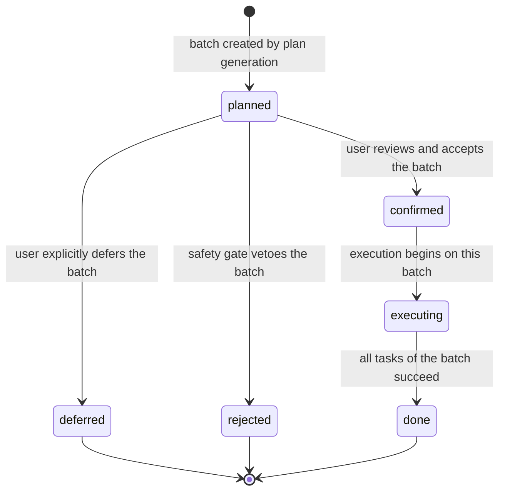

# Data Model: Speckit Todo Command

**Spec**: `020-speckit-todo-command`  
**Feature**: 025 · Todo Command  
**Created**: 2026-06-23  
**Status**: Draft  
**Purpose**: Describe the logical shape of the data consumed and produced by the `/speckit.todo` workflow — independent of any storage format, programming language, or persistence technology.

---

## Glossary

- **TodoBlock** — a single well-formed fenced `SPECKIT TODO` body extracted from one source file, together with its structural and paragraph-boundary context.
- **MalformedBlock** — a diagnostic record for a fence that could not be cleanly parsed (unclosed, nested, or unparseable); excluded from automatic planning.
- **TodoGroup** — a logical cluster of one or more `TodoBlock`s that share an affinity (same file, same heading, or same topic) and are planned/executed together.
- **TodoPlan** — the top-level reviewable artifact produced by one run of `/speckit.todo`: a scan summary plus an ordered sequence of `ExecutionBatch`es.
- **ExecutionBatch** — a bounded, sequential unit of review and execution containing up to 5 `TodoGroup`s (per FR-011) with a well-defined lifecycle status.

---

## Entities

### 1. TodoBlock

A well-formed, successfully parsed marked TODO block.

| Field              | Type              | Constraints                                                                 |
|--------------------|-------------------|-----------------------------------------------------------------------------|
| `block_id`         | string            | **Required, unique** within a scan run. Deterministic, e.g. `<file>:<opening_line>:<block_index>`. |
| `source_file`      | string            | **Required.** Workspace-relative path. MUST resolve to a location inside the current workspace root. |
| `opening_line`     | integer           | **Required.** 1-based line of the opening fence.                            |
| `closing_line`     | integer           | **Required.** 1-based line of the closing fence. MUST satisfy `opening_line < closing_line`. |
| `content`          | string            | **Required, non-empty.** The raw fenced block body with original formatting preserved. |
| `context_heading`  | string \| null    | Optional. The nearest enclosing Markdown heading above the block, if any.   |
| `prologue`         | string            | **Required.** Contextual text immediately *above* the block, bounded by the nearest blank line or section heading. May be the empty string when no such text exists. |
| `epilogue`         | string            | **Required.** Contextual text immediately *below* the block, bounded by the nearest blank line or section heading. May be the empty string when no such text exists. |

Validation rules:

- `source_file` MUST resolve inside the workspace (no upward traversal, no absolute escapes).
- `opening_line < closing_line`.
- `content` MUST be non-empty after trimming of the fence lines themselves.
- `block_id` MUST be unique within a scan run; determinism implies two identical runs over the same workspace produce the same set of IDs.

### 2. MalformedBlock

A diagnostic record for a fence that could not be parsed into a valid `TodoBlock`. Malformed blocks are reported but **never** included in automatic execution planning (FR-007).

| Field              | Type              | Constraints                                                                 |
|--------------------|-------------------|-----------------------------------------------------------------------------|
| `source_file`      | string            | **Required.** Workspace-relative path.                                      |
| `opening_line`     | integer           | **Required.** Line of the opening fence (or the offending construct).       |
| `reason`           | enum              | **Required.** One of: `unclosed_fence`, `nested_fence`, `unparseable`.      |
| `content_snippet`  | string            | **Required.** First 120 characters of the body, for diagnostics.            |
| `line_after_eof`   | boolean           | **Required.** `true` if the scanner reached end-of-file without finding a closing fence. |

### 3. TodoGroup

A logical cluster of related `TodoBlock`s produced by the affinity logic in the chat prompt.

| Field              | Type              | Constraints                                                                 |
|--------------------|-------------------|-----------------------------------------------------------------------------|
| `group_id`         | string            | **Required, unique** within a plan.                                         |
| `affinity_kind`    | enum              | **Required.** One of: `same_file`, `same_heading`, `same_topic`.            |
| `affinity_value`   | string            | **Required.** The shared value — a file path, a heading text, or a topic label. |
| `blocks`           | array of `TodoBlock.block_id` | **Required, non-empty.** References to blocks that share this affinity.     |

Validation rules:

- Every `block_id` referenced in `blocks` MUST exist in the plan's `TodoBlock` set.
- Every `TodoBlock` in the plan MUST appear in **exactly one** `TodoGroup` (a partition).

### 4. TodoPlan

The top-level artifact produced by a scan run. It is the single unit of review presented to the user (FR-010).

| Field                  | Type              | Constraints                                                                 |
|------------------------|-------------------|-----------------------------------------------------------------------------|
| `plan_id`              | string            | **Required, unique** per workspace per run.                                 |
| `created_at`           | ISO-8601 timestamp| **Required.**                                                               |
| `workspace_root`       | string            | **Required.** Absolute or workspace-relative root that was scanned.         |
| `total_blocks`         | integer           | **Required.** Count of valid `TodoBlock`s (excludes malformed).             |
| `malformed_blocks`     | integer           | **Required.** Count of `MalformedBlock` records produced by the scan.       |
| `excluded_files_count` | integer           | **Required.** Count of files skipped by the scanner (binary / ignored / dependency). |
| `batches`              | ordered array of `ExecutionBatch` | **Required.** The batches in presentation and execution order.              |

Validation rules:

- `sum(len(batch.groups) for batch in batches) == len(plan's TodoGroup set)`. Every group is scheduled exactly once.
- `total_blocks` MUST equal the sum of `len(group.blocks)` across all groups referenced by the plan's batches.
- When `total_blocks > 10`, the plan MUST contain more than one batch (FR-011).

### 5. ExecutionBatch

A bounded, reviewable unit of execution within a `TodoPlan`.

| Field                        | Type                      | Constraints                                                                 |
|------------------------------|---------------------------|-----------------------------------------------------------------------------|
| `batch_number`               | integer                   | **Required.** 1-based position within the parent plan's `batches` array.    |
| `groups`                     | array of `TodoGroup.group_id` | **Required, non-empty.** Max **5** entries per batch (FR-011).            |
| `status`                     | enum                      | **Required.** One of: `planned`, `confirmed`, `executing`, `done`, `deferred`, `rejected`. |
| `confirmation_received_at`   | ISO-8601 timestamp \| null| MUST be set when `status ∈ {confirmed, executing, done}`; MUST be null while `status == planned`. |
| `execution_log`              | string                    | **Required.** The post-execution output trail. Empty string until the batch has been executed. |

Validation rules:

- `len(groups) <= 5`.
- `batch_number` values across a plan MUST form the contiguous range `1 .. len(batches)`.
- `status` MUST obey the transition rules in **State Diagram** below.

---

## Relationships

- A **TodoPlan** contains many **ExecutionBatch**es, in `batch_number` order. A batch belongs to exactly one plan.
- An **ExecutionBatch** references many **TodoGroup**s via `groups`. A group is referenced by exactly one batch within a given plan.
- A **TodoGroup** contains many **TodoBlock**s via `blocks`. A block belongs to exactly one group within a given plan.
- A **TodoBlock** and a **MalformedBlock** are disjoint outcomes for the same source-level construct: a single fenced marker produces exactly one of the two, never both.
- A batch is bounded to at most 5 groups (FR-011); groups themselves have no size cap but the batching rule is triggered by the total valid-block count exceeding 10.

---

## State Diagram

The following diagram shows the canonical lifecycle of an `ExecutionBatch`. No other transitions are permitted.

Notes:

- `confirmed → planned` (rollback) is **not** permitted; once confirmed, the batch is committed to execution or explicit rejection.
- `executing → rejected` is **not** permitted; a safety veto must happen before execution begins.
- `deferred` and `rejected` are terminal states for the current plan run. A deferred batch may be re-materialized in a subsequent plan run, but that is a new `ExecutionBatch` instance with a new identity.

---

## Invariants

Cross-entity integrity rules that MUST hold for any well-formed `TodoPlan` instance:

1. **Block-partition invariant.** Every `TodoBlock.block_id` in the plan appears in the `blocks` array of **exactly one** `TodoGroup`. No block is orphaned; no block is duplicated across groups.
2. **Group-scheduling invariant.** Every `TodoGroup.group_id` in the plan appears in the `groups` array of **exactly one** `ExecutionBatch`. No group is unscheduled; no group is scheduled twice.
3. **Block-existence invariant.** Every `TodoBlock.block_id` referenced by any `TodoGroup.blocks` MUST exist in the plan's `TodoBlock` set.
4. **Group-existence invariant.** Every `TodoGroup.group_id` referenced by any `ExecutionBatch.groups` MUST exist in the plan's `TodoGroup` set.
5. **Batch-count invariant.** `sum(len(batch.groups) for batch in batches) == len(plan's TodoGroup set)`.
6. **Block-count invariant.** `plan.total_blocks == sum(len(group.blocks) for group in plan's groups)`.
7. **Batch-size invariant.** `len(batch.groups) <= 5` for every `ExecutionBatch` (FR-011).
8. **Batching-trigger invariant.** When `plan.total_blocks > 10`, `len(plan.batches) > 1`.
9. **Batch-number invariant.** The set of `batch_number` values across a plan's batches is exactly `{1, 2, …, len(plan.batches)}`.
10. **Workspace-bounds invariant.** Every `TodoBlock.source_file` and every `MalformedBlock.source_file` resolves to a path contained within `plan.workspace_root`. No path escapes upward.
11. **Line-ordering invariant.** For every `TodoBlock`: `opening_line < closing_line`.
12. **ID-uniqueness invariant.** `block_id` values are unique within a scan run; `group_id` values are unique within a plan; `plan_id` values are unique per workspace per run.
13. **Disjoint-outcome invariant.** A single fenced marker in source is represented by **either** a `TodoBlock` **or** a `MalformedBlock`, never both.
14. **Confirmation-timestamp invariant.** `confirmation_received_at` is non-null iff `status ∈ {confirmed, executing, done}`.
15. **Execution-log invariant.** `execution_log` is the empty string iff `status ∉ {executing, done}`. Once non-empty it is append-only within the same batch instance.
16. **Malformed-exclusion invariant.** `MalformedBlock` records never feed into any `TodoGroup.blocks`, and therefore never into any `ExecutionBatch`. They are reported for diagnostics only (FR-007).
17. **Affinity-consistency invariant.** Within a single `TodoGroup`, every referenced `TodoBlock` shares the declared `affinity_kind`/`affinity_value` (same file path, same heading text, or same topic label as assigned by the prompt's affinity logic).
