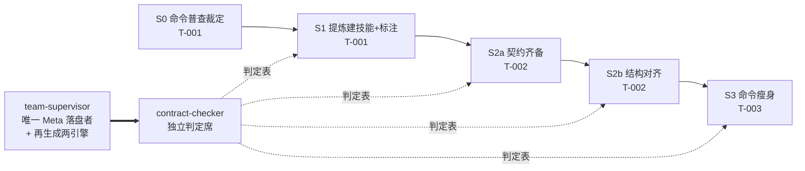

## Goal

**权威定义**：`.specify/goal/command-logic-as-classified-skills/goal.md`（`goal_slug` 引用，非内容副本）。以下为本团队视角的渲染，与定义冲突时以定义为准。

- **终态**：命令核心逻辑尽可能由技能承载；每个技能元数据带 internal / external 标注，标注如实表达它与 spec-kit 的依赖关系。
- **判据**：定义持有 1 条，**本文件不复述其文本** —— 判据是 `achieved` 的唯一权威，本团队 MUST NOT 自行增补或转写口径；需要口径时读定义。
- **覆盖缺口的如实记账**：该判据只覆盖 T-003 那一面。T-001 的「标注如实性」与 T-002 的「契约齐备性」在 goal 层没有判据，本团队以 **stage 级 `quality_gate`** 承担，并逐面点名承担者，以免声称覆盖而实际落空：
  - 标注的**存在性、取值域、如实性** → S1 gate ②③（属 T-001 的 stage 集，故 `--target T-001` 的运行会验到它）；
  - 名称 / 描述 / 触发定义齐备 → S2a gate ①②；
  - internal ↔ `.specify` 配合、external ↔ `.specify` 零依赖 → S2b gate ①②。

  这三面是**团队级**判据，与 goal 级判据权威层级不同，MUST NOT 混称；它们不构成 `achieved` 的依据。
- **范围外**：分发/处理体系依据 internal / external 标注进行的分流处理（定义的 `## Boundaries` 持有）。**该排除与 T-002 的结构条款不冲突** —— 2026-10-07 用户裁定：Boundaries 排除的是体系侧按标注分流，技能自身的结构契合属 T-002，故 S2b 正常执行。该裁定**无法写回 goal.md**（`goal-utils.py` 无 `boundary` 动作，定义文件禁手写），记账于 `territory.non_path` 的 `type: boundary-ruling`；引用 Boundaries 时 MUST 连该条一起读，否则会把它读成比裁定更宽。

## Static Structure

Role × Stage × Type 矩阵。Type 依「操作对象」判定，不由 Stage 推出；写面与派发模态逐席显式声明，不从 Type 推断。

| Agent | Role | Stage | Type | Lifecycle | 派发模态 | 写面（显式） |
|-------|------|-------|------|-----------|----------|--------------|
| `agent-team-supervisor-template` | team-supervisor | meta | **Meta** | temporary | virtual | canonical `skills/`、`templates/commands/`、两引擎的再生成输出、团队目录、progress、report |
| `agent-stage-executor-template` | skill-author | executor | Worker | temporary | virtual | **仅** `.specify/teams/.work/command-logic-as-classified-skills/`（补丁） |
| `structure-adjuster` | structure-aligner | executor | Worker | temporary | **native**（`.qoder/agents/` 已注册） | **仅** 运行工作区（对齐补丁） |
| `agent-stage-evaluator-template` | contract-checker | evaluator | **Meta** | temporary | virtual | **仅** 运行工作区（判定报告）；Meta 身份允许改技能定义，但本席不落 canonical |

**为何必须有 Meta supervisor**：本团队交付物本身就是技能定义（`SKILL.md` 及其 references/templates/scripts），依 `conceptual-model.md` §消解条款，此时 Lead 席位不是可选质量门而是**必需的 Meta 落盘者** —— Worker 只产补丁到工作区，由唯一 Meta 把它们落到 canonical 路径，并跑 `config.regeneration` 的两引擎。

**virtual 派发的代价（已记账，不是待办）**：四席里只有 `structure-adjuster` 能原生派发，其余三席引用的定义未安装到 `.qoder/agents/`，只能 virtual —— 无隔离、无并行、消耗本会话上下文（真源 `.specify/shared/definitions/subagent-definitions.md`）。因此各 stage 的批规模按 virtual 保守估，不按原生并行估。

## Dynamic Structure

**Pattern**：serial（质量优先）。选择依据：决策树 Q1 对本目标的**主体工作**为否（命令模板的技能化与瘦身是有界的一次性交付物改动，不是按 cadence 到达的流；「尽可能」这一长期性由 Goal lifecycle 承载 —— goal 长期 `active`、其下三条 Target 逐个关闭 —— 不必由团队形态承载，真源 `patterns.md` §Q1 判据）；Q2 为否（各 stage 共享同一批可变状态：技能清单、`skills/` 与 `.specify/skills/` 的对应关系、标注词表）；**Q3 命中**（严格序列：S3 瘦身后的命令要引用的技能由 S1 产出，S2 的质量条施加于 S1 的产物）。

> **为何不是 continuous**：continuous 强制 L1 报告态起步且不可跳级，L1 的 `max_subagents_per_cycle: 0` 意味着晋级前改不了任何 `skills/` 文件，即做不了 S1。

**Workflow**：

```json
{
  "workflow_id": "command-logic-as-classified-skills-chain",
  "name": "命令逻辑技能化与分类标注链",
  "stages": [
    {
      "stage_id": "S0-command-census",
      "agent_kind": "skill-author",
      "target_ref": "T-001",
      "task": "命令普查与技能化裁定（纯 attribution，不含建技能）：对 templates/commands/ 下每个命令模板逐个裁定三件事——① 其核心逻辑是否应下沉为技能（判否的须给理由，如该命令本就是纯编排）；② 下沉到哪个技能（新建 / 并入既有，须点名既有技能目录）；③ 该技能属 internal 还是 external（含义真源读 goal.md，术语与消歧读 .specify/memory/glossary.md 技能分类标注条）。**排除项：templates/commands/improve.md 归 session-driven-self-improvement 团队 S4，本团队 MUST 跳过——不裁定、不建对应技能、不计入分母**（裁定由 territory.forbidden 持有）。产出裁定表，每行一个命令。**本 stage 由 N 次派发累积：N = 计入命令数 ÷ 5 向上取整，计入命令数 = `find templates/commands -name '*.md' | wc -l` 减 1（排除 improve.md）。as-of 2026-10-07：该文件尚不存在，实扫 25 ⇒ 计入 25 ⇒ 5 批；对方团队创建后实扫 26 ⇒ 计入仍 25 ⇒ 仍 5 批。每批 5 个命令、按文件名字母序切分，每批判完立即写盘。** 累积是设计，MUST NOT 用 retry 预算承载。",
      "inputs_from": [],
      "outputs": [".specify/teams/.work/command-logic-as-classified-skills/S0-census/ruling.md"],
      "blockedBy": [],
      "quality_gate": "① 裁定表行数 == 计入命令数（重跑 `find templates/commands -name '*.md' | wc -l` 再减排除项，不用字面量），且表中 MUST NOT 出现 improve.md；② 每行三项裁定齐备，判「不下沉」的附理由；③ 每个已声明批次的命令名在产物中可检索（`grep -c`）；④ 整批判定附 ≥2 个实读文件证据；⑤ 门控扫描 total ≤ 23；⑥ 不含对 territory.forbidden 的改动"
    },
    {
      "stage_id": "S1-extract-annotate",
      "agent_kind": "skill-author",
      "target_ref": "T-001",
      "task": "按 S0 裁定表把命令核心逻辑提炼为技能包草稿（SKILL.md + 必要 references/templates/scripts），并在每个技能的元数据里写入 internal / external 标注字段。已委派技能的 7 个命令只做增量补齐，不重复建技能。**不为 improve.md 建任何技能包**（S0 已排除）。以 create-skills 的模板与约定为权威形态（Worker MUST NOT 直写 skills/，由 Meta 落地时经 create-skills 生成 canonical 骨架）。**本 stage 由 N 次派发累积：N = S0 裁定表中判「下沉且需新建」的行数（以裁定表为分母，不预设字面量；as-of 2026-10-07 的上界是 18 个尚未委派技能的命令），每批一个命令 → 一个技能包，每批完成立即写盘。**",
      "inputs_from": ["S0-command-census"],
      "outputs": [".specify/teams/.work/command-logic-as-classified-skills/S1-skills/"],
      "blockedBy": ["S0-command-census"],
      "quality_gate": "① 裁定表里每个判「下沉」的命令都有对应技能包草稿或指向既有技能的并入说明，且产物中 MUST NOT 出现 improve.md 对应的技能包（S0 已排除，本条使其在本 stage 本地可查而非只靠传递）；② 每个新技能包 frontmatter 含 name / description / 标注字段三项，标注取值只允许 internal 或 external；③ **标注如实性**（本条是 T-001「标注如实」面的唯一承担者）——每个标注附判定依据：标 external 的 MUST 给出「其 SKILL.md 与 references 中 .specify/ 路径依赖为零、或出现处均可降级为可选」的实读证据（对该技能文件跑 .specify/ 的 `grep -c` 计数 + 至少一处实读引用），标 internal 的 MUST 点名它服务的那条框架逻辑；仅查字段存在与取值域**不算**验到如实性；④ 产物字节数 ≥ 由批规模推出的下限（桩文件不得通过）；⑤ 每个已声明技能名在产物中可检索；⑥ 门控扫描 total ≤ 23；⑦ canonical 落盘后 config.regeneration 两引擎已跑且 --check 退出 0；⑧ 不含对 territory.forbidden 的改动"
    },
    {
      "stage_id": "S2a-contract-conformance",
      "agent_kind": "skill-author",
      "target_ref": "T-002",
      "task": "契约齐备性核查与修补（一种任务类型：逐技能契约 attribution，不含目录结构裁定——后者属 S2b，二者预算量级不同 MUST NOT 同 stage）：对 skills/ 下每个技能判定名称是否明确、描述是否说明「什么请求该用我」、触发定义是否可判定，缺项出补丁。范围含 S1 新建的技能。**本 stage 由 N 次派发累积：N = 实扫 SKILL.md 数 ÷ 10 向上取整，实扫数 = `find skills -name SKILL.md -not -path '*/server/*' | wc -l`（as-of 2026-10-07 基线 34，另加 S1 新增数），每批 10 个技能，每批判完立即写盘。**",
      "inputs_from": ["S1-extract-annotate"],
      "outputs": [".specify/teams/.work/command-logic-as-classified-skills/S2a-contract/conformance.md"],
      "blockedBy": ["S1-extract-annotate"],
      "quality_gate": "① 逐技能判定表行数 == 实扫 SKILL.md 数（重跑命令取分母）；② 每行三项（名称/描述/触发定义）各有判定，判缺项的附补丁路径；③ 整批判定附 ≥2 个实读文件证据；④ 每个已声明批次内的技能名可检索；⑤ 门控扫描 total ≤ 23；⑥ canonical 落盘后 config.regeneration 两引擎已跑且 --check 退出 0；⑦ 不含对 territory.forbidden 的改动"
    },
    {
      "stage_id": "S2b-structure-alignment",
      "agent_kind": "structure-aligner",
      "target_ref": "T-002",
      "task": "结构对齐（一种任务类型：技能与 .specify 目录结构的依赖关系裁定）：逐技能判定——标为 internal 的技能是否确实配合 .specify 目录结构（其读写面落在 .specify/ 内且路径存在）；标为 external 的技能是否对 .specify 零依赖（其 SKILL.md 与 references 中不出现 .specify/ 路径依赖，或出现处均可降级为可选）。含只读比对 skills/ 源与 .specify/skills/ 镜像的对应关系（镜像只经再生成引擎写入）。不符项出对齐补丁。**本 stage 由 N 次派发累积：N = 实扫 SKILL.md 数 ÷ 10 向上取整，实扫数 = `find skills -name SKILL.md -not -path '*/server/*' | wc -l`（as-of 2026-10-07 基线 34，另加 S1 新增数），每批 10 个技能，每批判完立即写盘。** **合法性前提已裁定（2026-10-07，用户明示）：goal.md 的 Boundaries 排除的是分发/处理体系按标注分流，不含技能自身的结构契合，故本 stage 正常派发修补、不停报告态——详见 territory.non_path 的 boundary-ruling 条。**",
      "inputs_from": ["S2a-contract-conformance"],
      "outputs": [".specify/teams/.work/command-logic-as-classified-skills/S2b-structure/alignment.md"],
      "blockedBy": ["S2a-contract-conformance"],
      "quality_gate": "① **覆盖度**——逐技能判定表行数 == 实扫 SKILL.md 数（重跑命令取分母）；少一行即判本 stage 未完成，MUST NOT 以「已判若干」通过；② 每行有 internal/external 与 .specify 依赖关系的判定，判定附实际检索到的路径证据（`grep -c` 计数 + 至少两处实读引用）；③ 每个判「不符」的技能有对齐补丁路径；④ 整批判定附 ≥2 个实读文件证据；⑤ 镜像未经手写改动（`sync-mirrors.py --check` 退出 0）；⑥ 门控扫描 total ≤ 23；⑦ canonical 落盘后 config.regeneration 两引擎已跑且 --check 退出 0；⑧ 不含对 territory.forbidden 的改动"
    },
    {
      "stage_id": "S3-command-thinning",
      "agent_kind": "skill-author",
      "target_ref": "T-003",
      "task": "命令瘦身：把 templates/commands/*.md 改写为更高层次的建模——每个命令模板只记录该调用哪些技能、如何调用、以及**每个技能的输入与产出**，实现细节全部下沉到技能。受**模板中立性**约束：瘦身后的模板 MUST NOT 嵌入本仓专属内容（真源 docs/reference/history/00-cross-cutting-lessons.md:124）。**排除项：templates/commands/improve.md MUST 跳过**——它归 session-driven-self-improvement 团队 S4，其薄壳由对方按本团队 T-003 约定出生即合规；本 stage MUST NOT 改写它、也 MUST NOT 把它计入分母。逐个命令改写，每个命令的 AUTO-GENERATED 头保持完好，落盘后由 supervisor 跑 regen-command-copies.py 同步四套副本树（MUST NOT 手改副本）。**本 stage 由 N 次派发累积：N = 计入命令数 ÷ 5 向上取整，计入命令数 = `find templates/commands -name '*.md' | wc -l` 减 1（as-of 2026-10-07 实扫 25 ⇒ 计入 25 ⇒ 5 批），每批 5 个命令，每批改完立即写盘。**",
      "inputs_from": ["S2b-structure-alignment"],
      "outputs": [".specify/teams/.work/command-logic-as-classified-skills/S3-thinning/"],
      "blockedBy": ["S2b-structure-alignment"],
      "quality_gate": "① 以 goal 判据原文为口径逐命令判定「是否只含技能调用与其输入产出、不含实现细节」，每行附判定与残留细节的具体位置；行数 == 计入命令数，且表中 MUST NOT 出现 improve.md；② 整批判定附 ≥2 个实读文件证据；③ 每个被点名技能的目录在仓内存在（`test -d`）；④ 门控扫描 total ≤ 23；⑤ `pytest -m contract` 不新增失败（同口径 A/B 失败集求差 + 差集逐项归因，不比绝对数字）；⑥ config.regeneration 两引擎已跑且 --check 退出 0，四套副本树与 templates/commands 一致；⑦ 不含对 territory.forbidden 的改动"
    }
  ],
  "handoff_protocol": "file-path-only",
  "progress_file": ".specify/teams/.work/command-logic-as-classified-skills/progress.md"
}
```

**DAG（无环）**：`S0 → S1 → S2a → S2b → S3`，线性链，拓扑序即派发序。



**每次交接的验证门（serial 的强制项）**：supervisor 消费 contract-checker 的判定表跑一次轻量检查 —— 下游 stage 的 `inputs_from` 契约是否被上游产物满足（如 S1 需要 S0 裁定表非空且每行可解析；S3 需要 S2b 判定表**行数等于实扫技能数**且每个待引用技能目录存在）。验证保持轻量，不做上游的全量重评。失败走 `failure_strategy: retry-once-then-escalate`，重试上限 2 次；MUST NOT 用 retry 预算承载 stage 的累积批数。

**Target 指派与递进序**：goal 层的 Target 集**无序**、切片间**无依赖边**，所以 `T-001 → T-002 → T-003` 的递进序只存在于本团队计划（`config.progression` + `config.target_map` + 上面的 DAG）。一次运行经 `/speckit.team run command-logic-as-classified-skills --target T-<nnn>` 聚焦一条切片，对应执行 `target_map` 里映射的 stage；不带 `--target` 时对 goal 整体运行（走完整条链）。本团队**不声明 `focus_target`**：它只是 run 级 `--target` 的预填，而三条切片会依次关闭，一旦 T-001 转 done，预填会让后续不带 `--target` 的运行撞上 run-checks 的「终态引用」而阻塞。显式逐次指派没有这个陷阱。

**跨会话续跑**：progress 文件存在即解析 stage 表定位状态，从第一个未完成 stage 继续；每个 stage 的累积批次以「已声明批次名在产物中可检索」为准，桩文件不算完成。

**Summary 刷新**：每个 stage 交接验证通过后刷新一次（`every: 1`），交付目录 `.specify/goal/command-logic-as-classified-skills/summary/`（由 `goal_slug` 派生，不由团队 slug 派生），非交互调用。门控顺序与状态行口径由 `skills/create-team/SKILL.md` §Summary Refresh 持有，run report 里 MUST 出现且只出现一条 `Summary:` 状态行。

## Self-Improvement Contract

- Subject: this persisted team definition; member executions are evidence.
- Observe: completed run reports and Post-Run Critique.
- Improve: follow `.specify/shared/workflow/self-improvement-workflow.md`; route through `improve-team`.
- Boundary: preserve team authority, maturity gates, budget, kill-switch, and verifier independence.
- Verify: validate now and wait for a comparable later run before claiming improvement.
