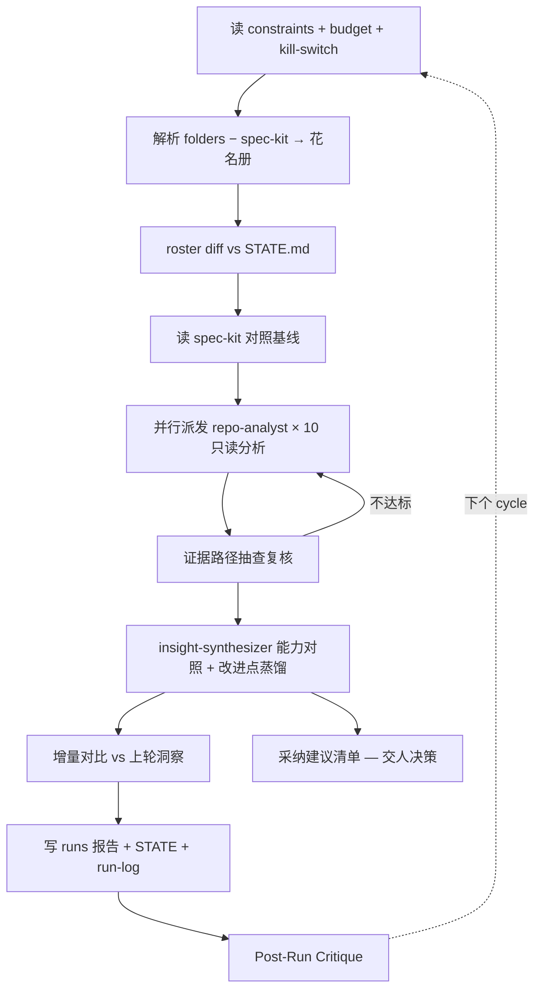

## Goal

以 `/cws_work/spec-kit`（用户自己的 Harness 项目，快速迭代中）为**受益方**，对 workspace `folders`
中除 spec-kit 外的 **10 个参考开源项目**做持续的只读分析（博采众家之长），每 cycle 产出四项：

1. **每仓特点档案** —— 项目定位、架构、独到机制、与 Harness/SDD 相关的设计。
2. **能力对照** —— 参考仓机制 vs spec-kit 现状（constitution / features / skills / commands / teams）。
3. **可采纳改进点清单** —— 每条注明：来源仓库、证据路径、建议落点（spec-kit 的具体文件/机制）、采纳成本档位（小/中/大）。
4. **增量视角** —— 相对上轮新增/变化的洞察（参考仓会持续拉新，spec-kit 会持续迭代）。

**成功标准**：四项齐全；每条改进点附来源证据路径且指向 spec-kit 具体落点；对全部被分析仓库**零写入**
（分析产物只落本团队目录与 run workspace）。

`N`（repo-analyst 实例数）= workspace `folders` 数 − 1（排除 home_project），每 cycle 按 folders 重算。当前 N=10。

## Static Structure

| Role | Stage | Type | Lifecycle | Responsibility |
|------|-------|------|-----------|----------------|
| team-supervisor | optimizer | Meta | persistent | 花名册解析（folders − spec-kit）、并行派发只读分析 subAgent、证据抽查、汇总洞察报告 |
| repo-analyst × 10 | executor | Worker | temporary | 每参考仓一个实例：定位/架构/独到机制/可迁移点，结构化档案+证据路径 |
| insight-synthesizer | evaluator | Worker | temporary | 对照 spec-kit 现状蒸馏可采纳改进点，按价值/成本分级，剔除已具备或不适配项 |

当前分析花名册（10 个参考仓，spec-kit 为对照基线不在其中）：
OpenSpec · superpowers · claw-code-agent · intellegix-code-agent-toolkit · claude-code-ts ·
claude-code-py · learn-claude-code · loop-engineering · ai-website-cloner-template · better-harness

## Dynamic Structure

`pattern: continuous`，maturity **L1**（报告态：只产出分析与建议；对被分析仓与 spec-kit 均零改动）。
subAgent 派发为**只读分析**，不属于 L1 所限制的"改动交付物"范畴（budget 允许 11 个/cycle）。

每个 cycle：

```
1. 读 constraints.md + budget + kill-switch；预算触顶按 on_80pct / on_100pct 降级或中止
2. 解析 workspace folders − home_project → 分析花名册；与 STATE.md 上轮 diff → 增减告警
3. 读 spec-kit 对照基线（constitution / features.md / skills 清单 / commands 清单）
4. 并行派发 repo-analyst × N（注入：仓库路径 + 只读边界 + 统一输出 schema + spec-kit 基线摘要）
5. 回收结构化档案；对"独到机制"类结论按证据路径抽查，不达标打回
6. insight-synthesizer 做能力对照与改进点蒸馏（来源+证据+落点+成本档位）
7. 增量对比：与 STATE.md 已记录洞察 diff，标注新增/变化/已采纳
8. 写 cycle 报告到 runs/ + 更新 STATE.md + append run-log.jsonl
   采纳动作只进"建议清单"，一律交人决策，不自动执行
9. Post-Run Critique：记录本轮低价值/重复洞察占比，用于晋级判据
```



## Lineage

- 由预置模板 `project-cluster` 实例化（`skills/create-team/templates/teams/project-cluster.md`;
  原名 `workspace-cluster`,2026-08-20 泛化改名——花名册从 .code-workspace 绑定推广为显式项目登记,
  本团队的花名册仍以 workspace folders 为种子源），
  该模板蒸馏自 2026-07 一次真实的 10 仓 IaC 集群运营 Session（复盘见 `draft/Code Workspace.md`）。
- **2026-07-30 goal 重定义**：原 goal 为"11 仓只读 git 一致性守护"（cycle 1 报告存档于
  `runs/20260730T082021Z-report.md`，其 git 巡检血统保留）。应用户明确要求改为"参考项目洞察收割、
  反哺 spec-kit"；结构随之对齐：spec-kit 从被巡检对象改为受益方基线，repo-analyst 11→10，
  consistency-checker → insight-synthesizer，cadence 4h→7d，budget 开放只读 subAgent 派发（0→11）。
  旧 goal 的误报统计按"目标切换基线规则"清零重计。
