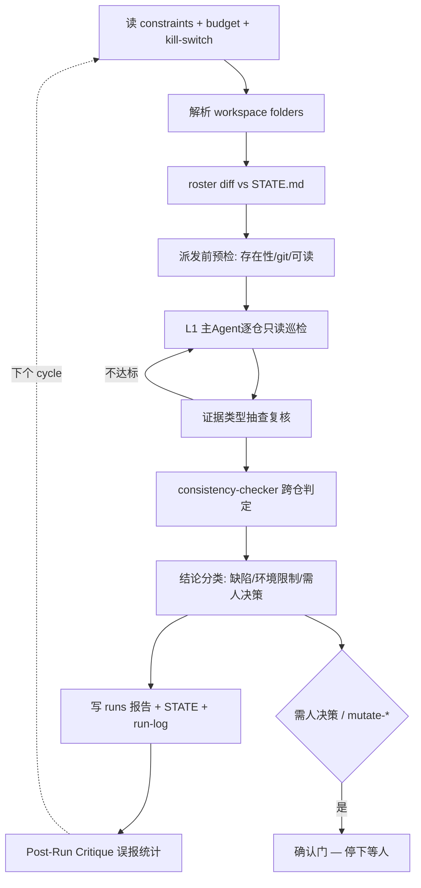

## Goal

对 `/cws_work/work.code-workspace` 的 `folders` 所定义的全部仓库，提供**持续的只读集群守护**。
每 4h 一个 cycle，产出四项：

1. **花名册与增减差异** —— 解析 workspace `folders`，与上轮 roster diff，成员增减自动告警。
2. **跨仓一致性判定** —— 分支策略符合性、工作区脏度、子模块边（若出现）、构建产物新鲜度、依赖解析链逐跳。
3. **问题清单** —— 每条明确归类为 **代码缺陷** / **环境限制** / **需人决策**。
4. **可操作修复建议** —— 指向具体仓库与路径。

**成功标准**：四项产出齐全；每条根因结论附带对应证据类型（"网络问题"必须附连通性证据）；
本 loop 对被守护仓库**零写入**（仅写本团队目录）。

`N`（repo-analyst 实例数）不是固定值 —— 它等于 workspace `folders` 的数量，随 workspace 文件变化而变化，
每 cycle 按 folders 重算。首轮实测 N=11。

## Static Structure

| Role | Stage | Type | Lifecycle | Responsibility |
|------|-------|------|-----------|----------------|
| team-supervisor | optimizer | Meta | persistent | 花名册解析与 diff、任务分解派发、证据抽查复核、汇总、确认门 |
| repo-analyst × 11 | executor | Worker | temporary | 每 folder 一个实例的只读分析与巡检，结构化输出 |
| consistency-checker | evaluator | Worker | temporary | 跨仓一致性判定与结论分类（评估对象是仓库业务信息 → Worker） |

首轮花名册（11 个 folder，全部已验证存在且为 git 仓库）：

| # | Folder（workspace 原值） | 解析路径 | 分支 |
|---|--------------------------|----------|------|
| 1 | `spec-kit` (相对) | /cws_work/spec-kit | master |
| 2 | `/cws_work/OpenSpec` | /cws_work/OpenSpec | main |
| 3 | `/cws_work/superpowers` | /cws_work/superpowers | main |
| 4 | `/cws_work/claw-code-agent` | /cws_work/claw-code-agent | main |
| 5 | `/cws_work/intellegix-code-agent-toolkit` | /cws_work/intellegix-code-agent-toolkit | master |
| 6 | `/cws_work/claude-code-ts` | /cws_work/claude-code-ts | main |
| 7 | `/cws_work/claude-code-py` | /cws_work/claude-code-py | main |
| 8 | `/cws_work/learn-claude-code` | /cws_work/learn-claude-code | main |
| 9 | `loop-engineering` (相对) | /cws_work/loop-engineering | main |
| 10 | `ai-website-cloner-template` (相对) | /cws_work/ai-website-cloner-template | master |
| 11 | `better-harness` (相对) | /cws_work/better-harness | main |

> **实测事实**：workspace 混用相对路径与绝对路径，相对路径以 workspace 文件所在目录 `/cws_work` 为基准解析。
> 11 个仓库**均无 `.gitmodules`** —— 子模块拦截规则保留声明，但当前无子模块边可守护。

## Dynamic Structure

`pattern: continuous`，maturity **L1**（不派遣 subAgent，主 Agent 亲自巡检并积累误报率数据）。

每个 cycle：

```
1. 读 constraints.md + budget + kill-switch；预算触顶按 on_80pct / on_100pct 降级或中止
2. 解析 /cws_work/work.code-workspace → folders → 花名册（相对路径以 /cws_work 为基准）
   与 STATE.md 上轮 roster diff → 成员增减告警
3. 派发前预检：每个 folder 的存在性 / 是否 git 仓库 / 可读性
   失败给出修复动作，不裸报错
4. L1：主 Agent 逐仓只读巡检（L2+ 起并行派发 repo-analyst，注入仓库路径 + 兄弟仓清单 + 只读边界 + 输出 schema）
5. 回收结构化结论；对"根因"类结论按证据类型抽查，不达标打回
6. consistency-checker 做跨仓判定（分支策略 / 脏度 / 子模块边 / 产物新鲜度 / 解析链逐跳）
7. 结论分类：缺陷 / 环境限制（预登记的已知预期失败）/ 需人决策
8. 写 cycle 报告到 runs/ + 更新 STATE.md + append run-log.jsonl
   需人决策项与 mutate-* 建议交确认门
9. Post-Run Critique：记录本轮误报，用于累计误报率统计
```



## Lineage

由预置模板 `workspace-cluster` 实例化（`skills/create-team/templates/teams/workspace-cluster.md`），
该模板蒸馏自 2026-07 一次真实的 10 仓 IaC 集群运营 Session（复盘见 `draft/Code Workspace.md`）。
本团队是该模板的**首次实例化**，同时用于验证预置模板 → 匹配 → 实例化这条流程。
