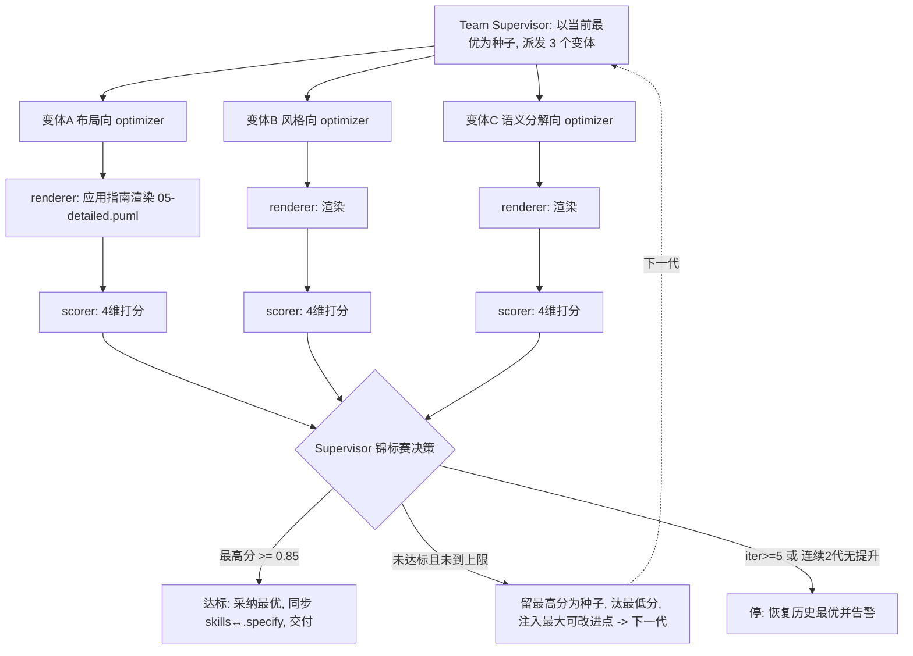

## Goal

**北极星（可验证）**：持续提升 `skills/draw-plantuml` 技能对**复杂大型图表**的绘制质量，使其产出**结构清晰、美观明确、心智负担低**的大图。

- **基准（benchmark）**：`docs/diagrams/05-detailed.puml`（真实项目 E2B 兼容沙箱服务全景架构图，155 行；缺少部分内容但当前结构足以测试明确美观的绘制）。
- **达标条件（每轮）**：加权评分 ≥ **0.85**，权重为 `美观 0.40 / 结构清晰 0.30 / 正确 0.20 / 心智负担 0.10`。
- **优先级约束**：对复杂大图，**美观度优先级最高**（这也是权重设计的体现）——整洁美观的大图降低用户处理信息的心智负担。
- **持续性（continuous）**：这是一个**持续优化**目标。单次 run 到阈值/上限即停；作为可复用团队多轮 re-run，逐代累积改进技能指南。改进落在 `skills/draw-plantuml/references/guide/`（layout / style / content / syntax-reference），并同步到 `.specify/skills/draw-plantuml/`。

> 静态结构（谁参与）与动态结构（怎么协作）都仅为达成此 goal 而存在。

## Static Structure

Role × Stage × Type 花名册（全部 temporary，由 `create-team/templates/` 实例化，不落 `.specify/agents/`）：

| Member | Role | Stage | Type | Lifecycle | 职责 / 改进角度 |
|--------|------|-------|------|-----------|-----------------|
| team-supervisor | team-supervisor | Meta（全阶段） | **Meta** | temporary | 定义质量维度/阈值；每代锦标赛选择（留优汰劣）；注入「最大可改进点」；决定 accept/improve/halt |
| variant-optimizer-layout | variant-optimizer | optimizer | Meta | temporary | **布局向**：grouping/together、ranksep/nodesep、hidden link 对齐、方向控制、减少连线交叉 |
| variant-optimizer-style | variant-optimizer | optimizer | Meta | temporary | **风格向**：配色体系/视觉层级、字体、skinparam、边框/箭头/圆角、留白节奏 |
| variant-optimizer-semantic | variant-optimizer | optimizer | Meta | temporary | **语义分解向**：拆包/分层子图、图例/标注、信息分块、层次抽象降低心智负担 |
| renderer | renderer | executor | **Worker** | temporary | 对每个变体的指南，渲染 benchmark → SVG/PNG（`render-plantuml.sh`，本地 jar + Noto CJK 回退） |
| scorer | scorer | evaluator | Worker | temporary | 按 4 维度对每个渲染产出打分，产出加权总分 + 每变体「最大可改进点」 |

**约束**：iteration 团队恰含**一个** Team Supervisor（Meta）。变体优化器数 = `config.variants`（默认 3）。

## Dynamic Structure

**Pattern**：`iteration`（淘汰/锦标赛策略）。**每代内多变体并行、跨代串行**。

**Loop 设置**：`threshold=0.85` · `max_iterations=5` · `regression_limit=2` · `variants=3` · 收敛判据「连续 2 代无提升」。

**握手**：file-path-only。每个变体独占运行工作区 `.specify/teams/.work/draw-plantuml-optimizer/gen-<N>/variant-<angle>/`（git-ignored 中间态），写入改进后的指南副本 + 渲染产物 + 打分卡；变体间零写重叠。最终交付物（命中并采纳的 `skills/draw-plantuml/references/guide/` 指南）落其真实路径；每次运行结束在 `.specify/teams/draw-plantuml-optimizer/runs/` 写一份 dated 报告。

### 单代执行流

**每代五相**（iteration 标准相位）：
1. **COORDINATE** — Supervisor 以当前最优指南为种子，给 3 个变体各派不同改进角度的子任务（territory = 各自变体工作区）。
2. **EXECUTE** — 变体优化器改进 `guide/` 指南副本 → renderer 用该副本重渲 benchmark，产出 SVG/PNG。
3. **EVALUATE** — scorer 对每个渲染产出按 4 维度打分，算加权总分，记录每变体「最大可改进点」。
4. **DECIDE** — 最高分 ≥ 0.85 → 达标停；`iteration ≥ 5` 或连续 2 代无提升 → 停并恢复历史最优；否则继续。
5. **IMPROVE** — 保留最高分为下一代种子、淘汰最低分，把评分器的最大可改进点注入下一代变异，使进化有方向。

**收尾**：达标或收敛后，采纳最优变体对 `skills/draw-plantuml/references/guide/` 的改进，**双写同步**到 `.specify/skills/draw-plantuml/`（`diff -rq` 校验字节一致），并产出 iteration 报告（评分明细 + 迭代历史 + lessons）。
