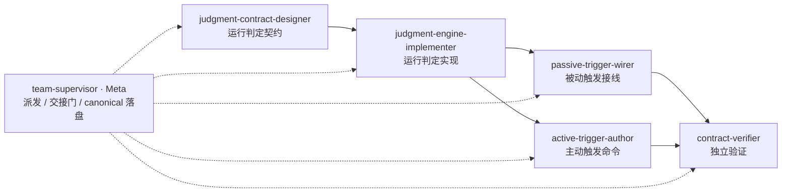

## Goal

**权威定义**：`.specify/goal/session-driven-self-improvement/goal.md`（`goal_slug` 引用，非内容副本）。以下为本团队视角的渲染，与定义冲突时以定义为准。

终态是框架中有一套 improve 流程，含两个方面：**主动触发**（通过 improve 命令）与**被动触发**（通过运行判定的结果触发 feedback 流程）。本目标只**建立**该流程，不**进行**提升。

### 本团队承接的四项细节（D9）

这四项在 `/speckit.goal` 收窄终态时被刻意从 `## Objective` 移出（决策 D9，账本：`.specify/memory/session/2026-10-05-goal-session-driven-self-improvement-interview.md`），由本团队承接。D1 全文仍逐字保存在 goal.md 的 `## History`，但那是 dated record，不作为当前现实被引用 —— 故在此落为团队的可执行输入。

1. **证据来源（三个）** — Session 历史记录（`.specify/memory/session/`）、用户输入、大语言模型调查结论（`.specify/memory/evidence/`，106 文件，MUST 走摘要/字段投影）。三者是运行判定的读取面，由 S1 契约规定各自口径。
2. **主动流程的内部形状 why → what → how** — why：当前的问题是什么（如 token 消耗过多、耗时过长、问题没有解决、用户不满意），即为什么要触发自我提升，由 session 历史获取；what：需要进行哪些提升，分析哪些方面需要提升；how：该如何进行提升 —— 分析问题、探索思路、实施改造。**这三段是主动 improve 流程自身的内部结构，不是本团队的 stage 计划，也不是 Goal 的 Target**（D3 裁定：阶段不进 Goal，`goal-definitions.md` 属性 2 不改）。本团队的 stage 是「建立这套流程」的工序，与流程内部的三段不同轴。
3. **被动模式的约束** — 被动触发不得面面俱到，以免干扰当前流程；超出当轮处置范围的发现，经新建 spec 或 todo 记录，留待主动触发处置。落点由 S3 承接。
4. **开放范围集合** — 提升对象包括但不限于命令、skills、memory。这是一个开放集合，登记在 frontmatter 的 `territory.non_path`（`type: scope-set`）而非 `write` 路径里 —— 因为它不是文件形状，且命令与 memory 今天在 SI-4 路由表里无归口，归口方式由 S1 契约决定。

### 四量口径裁定（B1–B4，2026-10-06，用户裁定）

本节是 S1 契约的**已定输入**，不是待议项。S1 MUST 据此撰写，MUST NOT 重新发明。

**B1 — 名称已定**：机制名为 **运行判定 (Run Determination)**，经用户批准通道定名。详见 `territory.non_path` 的 `type: naming` 与 `.specify/memory/glossary.md` 的 `运行判定` 词条（`origin=user`、`status=confirmed`）。S1..S5 的产物标识符、引擎文件名、字段名一律用此名。

**B2 —「正确性」拆两半，只做第一半**：

- **制品正确性（程序可判定，本轮实现）** — 口径 = 本 run 声明的检查里，**名字级失败集差集为空**，且每条返回绿的检查都留有**红先行取证或变异演练**。三件机械均已存在，不新造：`scripts/bash/run-tests.sh --names-out <file>`（第 22、29 行）产出排序后的 FAILED nodeid 列表，配合 `comm -13 baseline current` 求差；`red-first-evidence.md` 已在 051 / 052 / 053 三个特性目录实际存在；引擎退出码表全仓一致（0 / 2 / 3 / 4）。真源：`.specify/memory/glossary.md` 的 `名字级基线`、`Red-First 取证`、`变异演练` 三条。
- **语义正确性（不可程序判定，本轮不做）** — 「有没有答对用户的问题」这一类。要么交 LLM 评审、要么交指名人工评审；两者都合法（人工评审是同等形式的判据），但**破坏 Program-First**。若将来要做，MUST 作为**独立一轴**显式声明，MUST NOT 与制品正确性混进同一个数 —— 混了就无法打分。
- **边界（诚实声明）** — 只覆盖**声明了检查**的 run。未声明检查的 run 在这一轴 MUST 报 `not-evaluated`，**MUST NOT 报 `ok`**（与 053 已确立的 `NOT_EVALUATED` 口径、`run-checks` 对 check 2/3/4 的处理一致：未被评估的检查报绿与通过不可区分）。

**B3 — 满意度规则存活，改两处**：

1. **删掉「大部分情况」** —— 那是个对冲词，程序需要的是决策规则而不是概率表述。改为无条件规则，或给出可判定的例外条件（本裁定选后者，见下）。
2. **保留默认接受，加一条窄例外** —— 换话题 / 结束 session 仍默认视为接受（这是压低噪声底、让被动触发可用的要点，不可整个换成 `not-evaluated`，否则满意度轴长期无输入、机制等于不触发）；但若该换话题或结束**紧邻一个未解决的红**（某引擎非零退出，或某个已上报而用户始终未回应的异常），则记 `not-evaluated` 而非接受。
   - **不需要新存储**：`proactive-trigger` 每回合已写一行遥测到 `.specify/memory/trigger/telemetry.jsonl`（默认窗口 200 回合、追加即截断），「本回合是否存在未解决的红」是可导出的，MUST NOT 为此新建平行状态。
   - **已知代价（用户知情采纳）**：这条例外使满意度依赖正确性轴，四个量不再互相独立。若将来要解耦，把触发条件收窄到「仅引擎非零退出」—— 耦合更弱，但堵不住「上报了异常、用户没回应就换话题」那一类。

**B4 — `templates/commands/improve.md` 写权归本团队**：详见 `territory.non_path` 的 `type: cross-goal-write`。对方团队的排除条目已落盘，故 S4 照常交付薄壳本身，不再降级为「只交技能 + 薄壳规格」。

> **待办（不在本团队权限内）**：goal 定义的判据文本仍写「一套新的**判断逻辑**」、objective 仍写「通过**判断逻辑**的结果触发 feedback 流程」—— 二者都需经 `/speckit.goal` modify 采纳新名「运行判定」，并按 B2 收窄「正确性」。本团队 **MUST NOT** 写 `goal.md`：它在 `territory.forbidden` 内，且 `/speckit.goal` 是 goal 归档的唯一作者入口。在该修正落地前，本文件与 goal 定义之间存在一处**已知的术语分歧**，以本节的用户裁定为准。

### 判据

以 goal 定义为准，本文件不复述其文本（判据权威规则）。团队级只声明度量口径：判据按程度测，不渲染成二值勾选框；可用的程度读数是四个量中实际收归同一运行判定的数目（0→4）。**注意：goal 定义当前没有任何条款说明 `achieved` 如何判定**，这是本团队无法自行补齐的缺口，需经 `/speckit.goal` modify 由人裁定。

## Static Structure

Role × Stage × Type（Type 按**写目标**判定，不按 stage 名判定）：

| Role | Stage | Type | Lifecycle | 写目标（决定 Type） |
|------|-------|------|-----------|---------------------|
| team-supervisor | meta | **Meta** | persistent | canonical 定义文件 + 团队配置 → 必为 Meta |
| judgment-contract-designer | executor | Worker | temporary | 工作区补丁 |
| judgment-engine-implementer | executor | Worker | temporary | 工作区补丁 |
| passive-trigger-wirer | executor | Worker | temporary | 工作区补丁 |
| active-trigger-author | executor | Worker | temporary | 工作区补丁 |
| contract-verifier | evaluator | Worker | temporary | 验证记录（判定业务制品，不写 agent/skill/team 定义） |

**为什么必须有唯一 Meta**：本团队交付物是**定义类文件**（命令模板、workflow 规范、instructions 模板、引擎、契约测试）。按 `references/conceptual-model.md` § 消解条款，此时「每席皆 Worker」不成立 —— Worker 只产补丁到工作区，canonical 落盘由唯一 Meta supervisor 执行，Worker MUST NOT 直接写 canonical 定义文件。

## Dynamic Structure

**Pattern：serial（质量优先）** —— 派生依据（`references/patterns.md` 决策树，逐问留痕）：

- **Q1 长期/按 cadence？否。** 工作主体是**一次性交付物改动**（建立一套流程），长期性只体现在 goal 不设终止阈值 —— 该长期性由 Goal lifecycle 承载，不由团队形态承载。误判为 continuous 会强制 L1 起步（仅报告、不派 worker），有界交付工作于是停在报告态。
- **Q2 子任务独立、无共享可变态？否。** 各阶段共享同一批制品：运行判定契约、feedback 接线、instructions 模板。
- **Q3 严格序列（A 的输出喂 B 的输入）？是。** 契约 → 引擎 → 两个触发器 → 验证。→ **Serial Chain**。
- 非「优化」类 goal：本目标是**能力建立**（造一套流程），不是把某个既有制品从 A 提升到 B，故不设 `optimization_target` / `co_targets`。
- **preset 匹配**：`match-team-preset.py --goal "<终态+四项细节>"` → `confidence: none`，`matches: []`（扫描 2 个 preset）。无 preset 可复用，roster 与 pattern 均由 goal 派生。

**DAG**（已验无环，拓扑序 = S1 → S2 → {S3, S4} → S5）：

**Stage 定义**（| Stage ID | Agent Kind | Task | Inputs From | Outputs | Blocked By | Quality Gate |）：

| Stage ID | Agent Kind | Task | Inputs From | Outputs | Blocked By | Quality Gate |
|----------|-----------|------|-------------|---------|------------|--------------|
| judgment-contract-designer | executor | 运行判定契约：四个量的判定口径与输出形态、三个证据来源的读取面与摘要口径、两个触发器各自的消费点、对 feedback-step 三层无名判断的推广方式、命令与 memory 的 SI-4 归口 | goal.md、interview 账本、`shared/workflow/feedback-step.md`、`shared/workflow/self-improvement-workflow.md` | `.specify/teams/.work/session-driven-self-improvement/outputs/judgment-contract.md` | — | 契约同时点名四个量与三个来源，且为被动/主动各指明一个消费点；四量口径与「四量口径裁定」小节逐条一致（正确性只做制品正确性、满意度含窄例外、名称用运行判定），MUST NOT 重新发明；命令与 memory 的归口有明确结论或明确记为待定并说明由谁裁定 |
| judgment-engine-implementer | executor | 按契约把固定规则判断实现为 `scripts/python/` 下的确定性程序 + 单测 | judgment-contract.md | `.specify/teams/.work/session-driven-self-improvement/outputs/engine.patch`、`outputs/engine-tests.patch` | judgment-contract-designer | 程序可判定（非 LLM 估读）；对 evidence/ 的读取走摘要而非原文转储，产物中可检索到该口径的声明 |
| passive-trigger-wirer | executor | 运行判定结果 → feedback 流程的接线补丁，含被动模式「不得面面俱到、超出者落 spec/todo」的约束 | judgment-contract.md、engine.patch | `.specify/teams/.work/session-driven-self-improvement/outputs/passive.patch` | judgment-engine-implementer | 四条红线逐条对照未被破坏（尤其 never-solicit 与零自动传输）；改点落为 sensor 而非平行干预台账；约束条款可在补丁中检索到；**落盘前跑 `python3 scripts/python/scan-confirmation-gates.py` 且 total ≤ 23**（本文件落在 SCAN_DIRS 内，预算余量 0） |
| active-trigger-author | executor | `templates/commands/improve.md` 薄壳 + 承载逻辑的技能侧文本，实现 why → what → how | judgment-contract.md、engine.patch | `.specify/teams/.work/session-driven-self-improvement/outputs/active-command.patch`、`outputs/active-skill.patch` | judgment-engine-implementer | why/what/how 三段各有落点且消费运行判定引擎；命令文本为入口+委派（无实现细节内联），且**逐个记录被调用技能的输入与产出**，完整符合 command-logic-as-classified-skills T-003 原文（「每个技能的输入和产出」子句于 2026-10-07 补齐，此前四处渲染均漏；对方团队 S3 已裁定跳过 improve.md，故本 gate 是该文件唯一的 T-003 判定门）；**落盘前跑 `python3 scripts/python/scan-confirmation-gates.py` 且 total ≤ 23**（templates/commands 在 SCAN_DIRS 内，预算余量 0）；技能侧落点名经 S1 契约定下后，MUST 先经 `/speckit.team` modify 把该**具名**目录追加进本团队 write **并**在对方团队 forbidden 中排除它，才可派发第二次累积 —— 对方 write 含 `skills/*/SKILL.md`、`skills/*/references|templates|scripts/**`，与本团队将来的具名技能目录构成**已知的前向冲突**，处置路径与 improve.md 同（用户授权 + forbidden 排除），MUST NOT 静默双写 |
| contract-verifier | evaluator | 独立验证 S3/S4 落盘结果 | passive.patch、active-command.patch、active-skill.patch、progress.md | `.specify/teams/session-driven-self-improvement/runs/<UTC>-verification.md` | passive-trigger-wirer, active-trigger-author | 见 Verification 口径（回归数字注明全量/子集；既存失败走同口径 A/B 差集归因；One-Source-Of-Truth 类验收从落盘产物反查） |

**粒度声明**（`references/patterns.md` § Serial Chain → Stage granularity discipline，落盘前已按文件计数校验）：

- 计数依据（程序步骤，非估读）：`templates/commands` 25 · `scripts/python` 39 · `shared/workflow` 14 · `shared/guidelines` 13 · `shared/definitions` 10 · `shared/patterns` 4 · `agents` 2 · **`skills` 13687**。
- **`skills/` 的 13687 文件是本表唯一的规模风险**：故 `territory.write` 不含 `skills/**`；S4 若需在技能侧落文本，其目录名由 S1 契约决定后，经 `/speckit.team` modify 追加**具名**技能目录，MUST NOT 以 `skills/**` 通配承接。
- **`active-trigger-author` 由 2 次派发累积**（N=2）。依据：`command-logic-as-classified-skills` T-003 要求命令只保留入口与委派、实现细节落技能侧，故交付物天然是两个制品（命令薄壳 + 技能文本），一次派发无法同时承载两种任务类型。派发载荷 MUST 带 `incremental_landing` 字段。**累积不是 retry**：本链 `max_retries: 2` 只承载失败恢复，MUST NOT 用 retry 预算承载这 2 次累积。
- **一个 stage 一种任务类型**：S1 设计 / S2 实现 / S3 接线 / S4 撰写 / S5 验证，互不混装；attribution 与 reconciliation 未同 stage。

**Handoff**：file-path-only —— 下游只收路径清单，不接收文件内容；下游 MUST NOT 修改上游产物。

**每交接验证**（serial 的强制门，保持轻量）：验证本步产物满足下游 `inputs_from` 契约，而非重跑全量评估。失败时按 `retry-then-halt`：产物缺失/agent 崩溃 → retry（≤2）；质量门轻微失败 → 对产物调 `improve-agent`；质量门严重失败 → halt 并报告。

**Substance floor**：`outputs exist` 是必要非充分 —— 桩文件同样「存在」，同样能解锁下游。每个 stage 的 VALIDATE MUST 至少跑一条程序可判定检查（字节下限，或声明范围目录名在产物中可检索）。S5 声称「整批完成」时 MUST 附 ≥2 个实读文件的证据（路径 + 从该文件读到的具体事实），MUST NOT 以产物条目数或子代理自述充当覆盖度。

**Progress**：`.specify/teams/.work/session-driven-self-improvement/progress.md`（stage 表 + Handoff Log）。跨 session 续跑时先解析该表，从第一个未完成 stage 继续。

**Summary 边界**：每个 stage 交接验证通过后刷新 goal summary，交付目录 `.specify/goal/session-driven-self-improvement/summary/`（由 `goal_slug` 派生，不由团队 slug 派生）；门序为 Budget → Cadence → Material → Overlap，两次交接紧邻时合并为一次刷新；有界 pattern 默认 `every: 1`。首次刷新需声明 summary 机制已激活及其生效 cadence。

## Self-Improvement Contract

- Subject: this persisted team definition; member executions are evidence.
- Observe: completed run reports and Post-Run Critique.
- Improve: follow `.specify/shared/workflow/self-improvement-workflow.md`; route through `improve-team`.
- Boundary: preserve team authority, maturity gates, budget, kill-switch, and verifier independence.
- Verify: validate now and wait for a comparable later run before claiming improvement.
