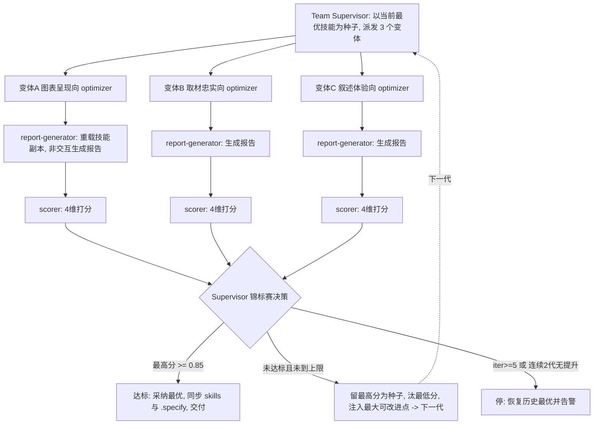

## Goal

**北极星（可验证）**：反复迭代优化 `skills/summarize-project` 技能定义，使其生成的项目总结报告达到用户预期——**文本综述与可视化图表并重**、可溯源、单文件自包含，外部读者一眼看清项目结构与进度。

- **优化对象（target）**：`skills/summarize-project/`（SKILL.md + references/ 六份层文档）——迭代真正修改的东西。
- **基准（benchmark）**：spec-kit 项目自身（`.specify/` 工件：specs/*/requirements.md、tasks.md、memory/features.md 等）——不动的输入，每代由它重新生成被评分的报告。
- **达标条件（每轮）**：加权评分 ≥ **0.85**，权重为 `图表质量 0.40 / 内容忠实 0.25 / 叙述质量 0.20 / 一致合规 0.15`。
- **优先级约束**：**图表质量权重最高**——当前技能的主要短板在可视化效果（WBS/甘特/里程碑图的清晰与美观）。
- **优化分类**：持续优化 + 淘汰（elimination）策略。单次 run 到阈值/上限即停；作为可复用团队多轮 re-run 逐代累积改进。改进落在 `skills/summarize-project/` 并双写同步 `.specify/skills/summarize-project/`。

> 静态结构（谁参与）与动态结构（怎么协作）都仅为达成此 goal 而存在。

## Static Structure

Role × Stage × Type 花名册（全部 temporary，由 `create-team/templates/` 实例化，不落 `.specify/agents/`）：

| Member | Role | Stage | Type | Lifecycle | 职责 / 改进角度 |
|--------|------|-------|------|-----------|-----------------|
| team-supervisor | team-supervisor | Meta（全阶段） | **Meta** | temporary | 定义质量维度/阈值；每代锦标赛选择（留优汰劣）；注入「最大可改进点」；决定 accept/improve/halt |
| variant-optimizer-visual | variant-optimizer | optimizer | Meta | temporary | **图表呈现向**：WBS/甘特/里程碑图生成指引——布局、配色、信息分块、渲染成功率、draw-plantuml 委托契约 |
| variant-optimizer-content | variant-optimizer | optimizer | Meta | temporary | **取材忠实向**：信息源识别与采集、条目溯源、状态/进度提取、功能分解树组织、不臆造门禁 |
| variant-optimizer-narrative | variant-optimizer | optimizer | Meta | temporary | **叙述体验向**：文本综述质量、外部读者语言、章节结构、图文配合说明、单文件自包含交付 |
| report-generator | report-generator | executor | **Worker** | temporary | 每代重载最新技能副本，非交互模式对 benchmark 重新生成候选报告（图表渲染委托 draw-plantuml） |
| scorer | scorer | evaluator | Worker | temporary | 按 4 维度对每份候选报告打分，产出加权总分 + 每变体「最大可改进点」（强制格式 `[DIM]_SCORE` / `WEIGHTED_TOTAL` / `SUGGESTIONS`） |

**约束**：iteration 团队恰含**一个** Team Supervisor（Meta）。变体优化器为 Meta——其操作对象是技能定义（agent 配置层）；report-generator 与 scorer 操作业务产物（报告）→ Worker。变体优化器数 = `config.variants`（3），角度互相正交。

## Dynamic Structure

**Pattern**：`iteration`（淘汰/锦标赛策略）。**每代内多变体并行、跨代串行**。

**Loop 设置**：`threshold=0.85` · `max_iterations=5` · `regression_limit=2` · `variants=3` · 收敛判据「连续 2 代无提升」。

**优化闭环（`score = f(target)` 不变量）**：变体优化器**只改技能副本**（target），绝不手改报告；report-generator 每代**重载最新技能副本**、从 benchmark 重新生成报告；scorer 只对重新生成的报告打分——保证评分度量的是技能质量而非手调产物。

**握手**：file-path-only。每个变体独占运行工作区 `.specify/teams/.work/summarize-project-optimizer/gen-<N>/variant-<angle>/`（git-ignored 中间态），写入改进后的技能副本 + 候选报告 + 打分卡（结构化 result manifest）；变体间零写重叠。最终交付物（胜出并采纳的 `skills/summarize-project/` 改动）落其真实路径并双写同步 `.specify/skills/summarize-project/`；每次运行结束在 `.specify/teams/summarize-project-optimizer/runs/` 写一份 dated 报告。

### 单代执行流

**每代五相**（iteration 标准相位）：
1. **COORDINATE** — Supervisor 以当前最优技能副本为种子，给 3 个变体各派不同改进角度的子任务（territory = 各自变体工作区）。
2. **EXECUTE** — 变体优化器改进技能副本（SKILL.md / references/ 层文档）→ report-generator 重载该副本，非交互模式对 benchmark 项目重新生成候选报告（图表渲染委托 draw-plantuml，渲染失败计入 chart-quality 扣分）。
3. **EVALUATE** — scorer 对每份候选报告按 4 维度打分，算加权总分，记录每变体「最大可改进点」。
4. **DECIDE** — 最高分 ≥ 0.85 → 达标停；`iteration ≥ 5` 或连续 2 代无提升 → 停并恢复历史最优；否则继续。
5. **IMPROVE** — 保留最高分为下一代种子、淘汰最低分，把评分器的最大可改进点注入下一代变异，使进化有方向。

**收尾**：达标或收敛后，采纳最优变体对 `skills/summarize-project/` 的改进，**双写同步**到 `.specify/skills/summarize-project/`（`diff -rq` 校验字节一致），并产出 iteration 报告（评分明细 + 迭代历史 + lessons）。
