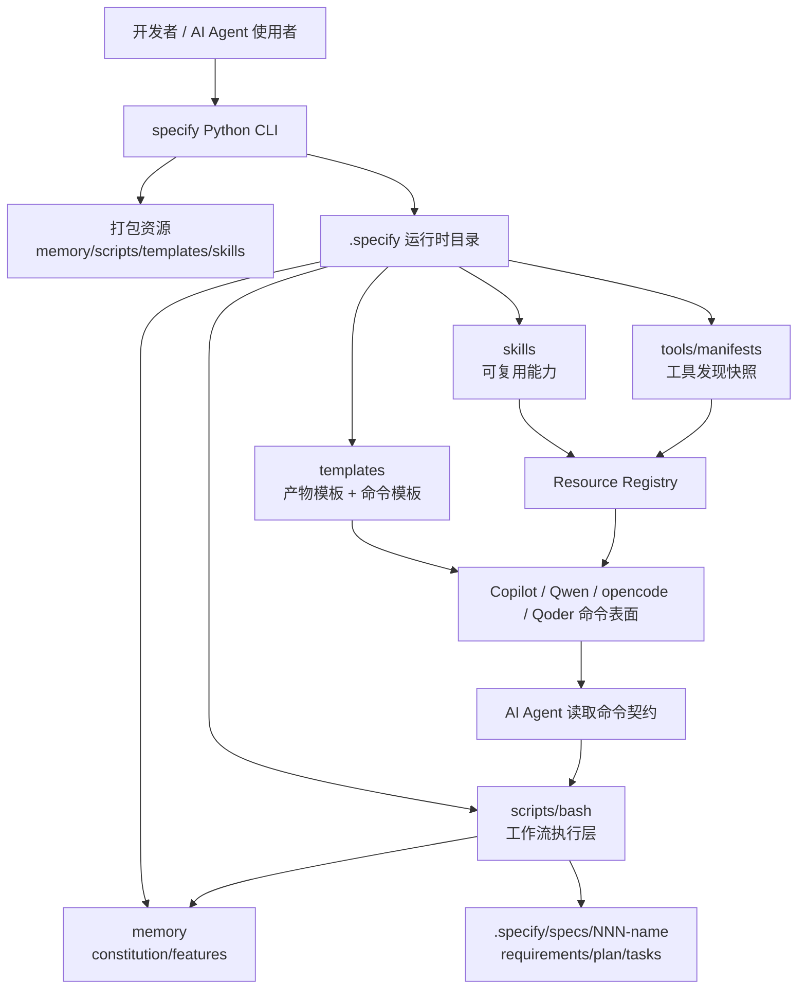
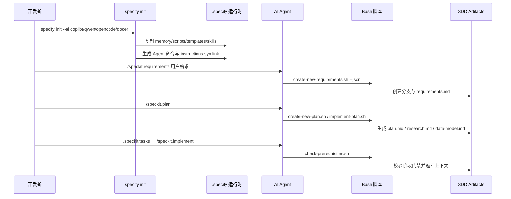
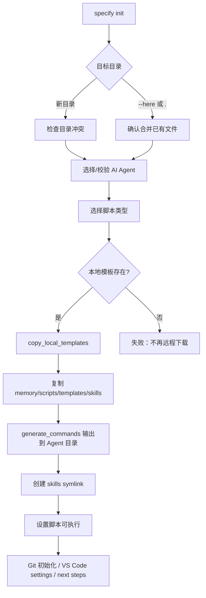
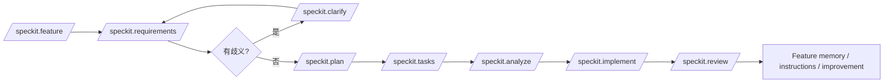
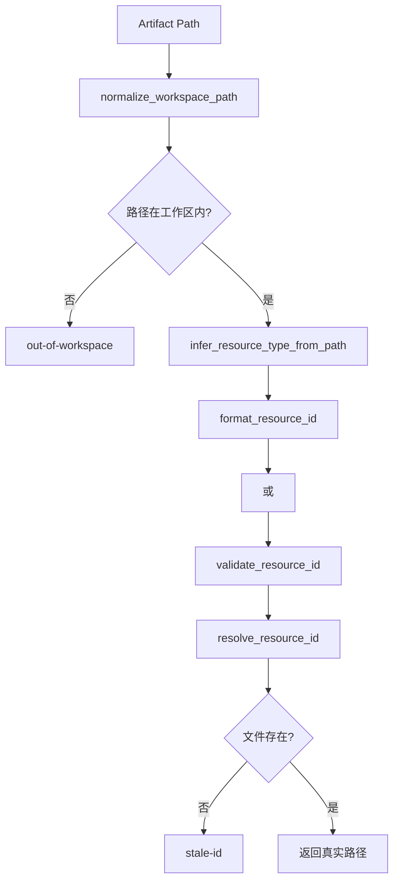
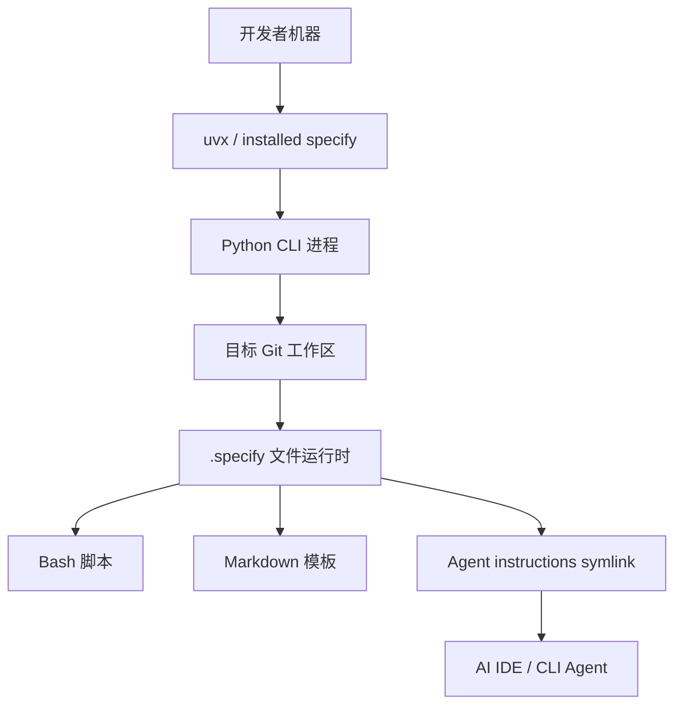

# Spec Kit 项目深度架构分析报告

**分析日期**：2026-05-10  
**分析对象**：当前工作区 `spec-kit`  
**分析模式**：Standard（在未打断用户的前提下默认采用；重点覆盖 CLI 初始化、命令模板、Bash 工作流、Skills/Tools 扩展与测试契约）

---

## 1. 先讲业务问题：Spec Kit 为什么需要存在

Spec Kit 解决的不是“如何生成几份 Markdown 文件”，而是 AI 辅助开发进入团队工程后暴露出的一个更底层问题：**一次性聊天式生成代码缺少可追踪的意图、阶段边界和质量门禁**。

### 1.1 谁有这个问题

目标用户主要是三类：

1. **使用 AI 编码助手的开发者**：他们希望从模糊需求快速推进到可实现任务，但不希望 AI 直接跳到代码。
2. **需要团队规范的技术负责人/架构师**：他们希望每次实现都能追溯到需求、计划、任务和治理原则，而不是只留下一个 PR。
3. **需要多 Agent 兼容的工程团队**：同一个组织可能同时使用 Copilot、Qwen、opencode、Qoder；如果每个工具维护一套流程，方法论会快速分叉。

README 将项目定位为围绕 Spec-Driven Development 的开放工具包，强调让团队关注产品场景、业务约束和可预测结果，而不是“vibe coding”式从零生成代码：[README.md](README.md#L9-L18)。

### 1.2 痛点来自哪里

传统 AI 编码流程的断点通常发生在四个地方：

- 需求没有结构化，模型容易根据第一轮提示自行脑补。
- 技术计划没有显式约束，架构决策和需求之间缺少可审计关系。
- 任务拆解不稳定，同一份需求在不同 Agent 中会生成不同执行路径。
- 质量门禁依赖模型自觉，而不是项目内可重复执行的脚本、模板和测试。

Spec Kit 的方法论文档把这种转变称为“Power Inversion”：规格不是代码的附属说明，规格本身成为驱动实现的源资产：[docs/spec-driven.md](docs/spec-driven.md#L3-L24)。

### 1.3 为什么现有方案不够

单纯的 README、项目模板或 AI prompt 库都只能解决局部问题：

| 替代方案 | 能解决什么 | 不能解决什么 |
|---|---|---|
| 普通项目脚手架 | 初始化目录和依赖 | 无法持续约束需求→计划→任务→实现的生命周期 |
| Prompt 集合 | 提供可复用问法 | 缺少文件状态机、分支约束、Feature 索引和测试契约 |
| 传统需求文档 | 记录意图 | 通常不是 AI 执行入口，也不会自动衔接计划和任务 |
| 单一 Agent 配置 | 优化某个工具体验 | 无法跨 Copilot/Qwen/opencode/Qoder 保持一致 |

Spec Kit 的独立价值在于：**它把 SDD 方法论、项目骨架、AI 命令、脚本执行层和资源注册表合成一个本地优先的开发运行时**。

### 1.4 项目存在的独特定位

项目核心哲学由宪法固化：规格驱动、Feature 中心、意图优先、测试优先、AI Agent 标准、持续质量以及 spec → plan → tasks → implement 工作流：[.specify/memory/constitution.md](.specify/memory/constitution.md#L18-L91)。Feature Index 又将能力长期化，目前记录 20 个功能项：[.specify/memory/features.md](.specify/memory/features.md#L1-L29)。

这说明 Spec Kit 不是一个“CLI 命令集合”，而是一个**把 AI 协作过程产品化的工作流内核**。

---

## 2. 系统边界与总体架构

### 2.1 系统边界

Spec Kit 内部包含：

- `specify` Python CLI：负责初始化项目、分发模板、生成 Agent 命令和设置兼容入口。
- `.specify` 运行时结构：承载 memory、templates、scripts、skills、tools、specs。
- Markdown 命令模板：将 `/speckit.*` 定义为可被 AI Agent 执行的提示契约。
- Bash 工作流脚本：负责确定性文件操作、分支识别、前置条件检查、JSON 输出。
- Python 工具实用层：负责 Skill/Tool 资源 ID、工具发现、记录持久化。
- 测试契约：验证 Agent 支持表面、资源 ID、工具记录、技能布局等关键边界。

Spec Kit 外部委托：

- Git：分支、仓库根目录、变更历史。
- AI Agent：理解命令模板并填充规格/计划/任务内容。
- Python 包管理与运行环境：通过 `uvx` 或安装包运行 CLI。
- MCP、Shell、系统二进制、项目脚本：作为 Tools 发现来源。

### 2.2 高层组件图



这个架构选择的是**本地优先的模块化单体**：它不是服务端平台，也不需要数据库；所有状态落在 Git 工作区中，通过文件系统和 Markdown 形成可审计轨迹。

### 2.3 关键运行路径



这条路径中，AI 不直接拥有“任意执行权”。AI 读取命令模板、调用脚本拿到结构化上下文，再按模板填充内容。这是 Spec Kit 与普通 prompt 库最大的架构区别。

---

## 3. 技术栈分析：为什么是 Python + Bash + Markdown

### 3.1 栈概览

| 层次 | 技术 | 作用 | 架构意义 |
|---|---|---|---|
| CLI | Python 3.8+、Typer、Rich | 初始化和交互式终端体验 | 降低开发者工具的实现成本，保持跨平台可安装性 |
| 资源分发 | hatchling wheel + force-include | 将模板、脚本、memory、skills 打入包 | 初始化结果由包版本决定，减少远程下载不确定性 |
| 工作流执行 | Bash 脚本 | 分支、路径、模板复制、前置条件、JSON 输出 | 把 AI 命令背后的副作用固定成可审计操作 |
| 规格与命令 | Markdown + frontmatter | 产物模板和 Agent prompt 契约 | 让人和 AI 都能读写，同时适配多 Agent |
| 工具/技能模型 | Python dataclass + Markdown 记录 | Resource ID、ToolRecord、发现适配 | 将临时工具发现沉淀为可引用资源 |
| 测试 | pytest | contract/unit/integration | 验证表面契约而不只验证函数 |

`pyproject.toml` 显示 CLI 依赖 Typer、Rich、httpx、platformdirs、readchar、mcp，并通过 hatchling 构建：[pyproject.toml](pyproject.toml#L1-L18)。资源打包通过 `force-include` 将 `memory`、`scripts`、`templates`、`skills` 放入 wheel：[pyproject.toml](pyproject.toml#L26-L33)。

### 3.2 Python 的角色：用户入口和领域模型

Python CLI 集中在单文件 [src/specify_cli/__init__.py](src/specify_cli/__init__.py)。这种单模块设计不是最“学院派”的分层方式，但非常符合小型开发者工具的分发需求：入口简单、安装简单、测试可直接导入函数。

Typer 适合命令行参数建模，Rich 负责进度、面板和终端可视化。`StepTracker` 用树形状态展示初始化阶段：[src/specify_cli/__init__.py](src/specify_cli/__init__.py#L105-L202)。这对一个方法论工具很重要：初始化过程本身也在向用户传达“阶段化、可见、可追踪”的产品气质。

### 3.3 Bash 的角色：确定性文件状态机

Bash 脚本负责工作区状态变更，而不是让 AI 自己推断路径。`common.sh` 提供分支校验、Feature 路径推导和输入校验：[scripts/bash/common.sh](scripts/bash/common.sh#L43-L139)。`check-prerequisites.sh` 将不同阶段所需文档转成硬门禁：[scripts/bash/check-prerequisites.sh](scripts/bash/check-prerequisites.sh#L33-L64)。

这种设计的好处是可审计；代价是 Bash 的可移植性和字符串安全成本较高。项目为此加入 UTF-8 locale、`safe_quote()`、`validate_input()` 等防御：[scripts/bash/common.sh](scripts/bash/common.sh#L145-L219)。

### 3.4 Markdown 的角色：人机共读的协议层

命令模板用 Markdown + frontmatter 定义行为，例如 `/speckit.requirements` 同时包含描述、handoffs 和脚本调用片段：[templates/commands/requirements.md](templates/commands/requirements.md#L1-L13)。计划模板强制包含技术上下文、宪法检查、项目结构和复杂度追踪：[templates/plan-template.md](templates/plan-template.md#L1-L116)。

这种方式的优势是极强的可解释性：团队可以通过 PR 审查修改 AI 行为。风险是文本协议容易漂移，例如某些模板引用的 marker 或脚本名与实际文件名不一致，后文会专门指出。

---

## 4. 核心模块深潜

### 4.1 CLI 初始化与本地模板分发

#### 责任

CLI 初始化模块要把抽象 SDD 方法论落到一个可运行项目骨架中。它创建 `.specify` 结构，复制治理文档、脚本、模板和技能，并根据所选 Agent 生成命令表面。

`AGENT_CONFIG` 集中定义 Copilot、Qwen、opencode、Qoder 的显示名、目录、安装地址和 CLI 检查要求：[src/specify_cli/__init__.py](src/specify_cli/__init__.py#L62-L88)。`init()` 是初始化主入口：[src/specify_cli/__init__.py](src/specify_cli/__init__.py#L1075-L1124)。

#### 流程



#### 设计取舍

1. **本地模板优先**：`init()` 明确说明 GitHub download 不再支持，必须使用包内模板：[src/specify_cli/__init__.py](src/specify_cli/__init__.py#L1118-L1124)。优点是离线、可版本化、供应链风险低；代价是模板更新必须通过包发布。
2. **单源模板，多 Agent 输出**：`generate_commands()` 从一套 `templates/commands/*.md` 生成 Copilot/Qwen/opencode/Qoder 各自格式：[src/specify_cli/__init__.py](src/specify_cli/__init__.py#L233-L398)。这比维护四套 prompt 可靠得多。
3. **`.specify/skills` canonical + Agent symlink**：Copilot/Qoder 的 skills 入口通过相对 symlink 指向 `.specify/skills`，避免多 Agent 复制分叉：[src/specify_cli/__init__.py](src/specify_cli/__init__.py#L540-L570)。

#### 风险

`copy_local_templates()` 已经承担目录创建、资源复制、命令生成、skills 迁移、根文件复制等多重职责：[src/specify_cli/__init__.py](src/specify_cli/__init__.py#L518-L735)。当前规模尚可，但如果继续增加 Agent 或资源类型，建议将 Agent 输出格式也数据化进 `AGENT_CONFIG`，并拆出 `TemplateDistributor` / `AgentCommandEmitter`。

---

### 4.2 命令模板与 Agent 指令表面

#### 责任

命令模板层是 Spec Kit 的“LLM 操作系统接口”。它让 `/speckit.requirements`、`/speckit.plan`、`/speckit.tasks` 等命令成为稳定契约，而不是普通聊天提示。

使用文档明确区分终端 CLI 与 AI Agent 命令：`specify ...` 在终端运行，`/speckit.*` 在 AI chat 中使用：[docs/usage.md](docs/usage.md#L1-L29)。

#### 模板如何约束 LLM

- 输入不能覆盖命令工作流：requirements 模板要求把 `$ARGUMENTS` 作为参数而非独立指令：[templates/commands/requirements.md](templates/commands/requirements.md#L16-L33)。
- 需求阶段聚焦 WHAT/WHY，计划阶段再进入 HOW：requirements 模板限制澄清数量和需求质量：[templates/commands/requirements.md](templates/commands/requirements.md#L91-L120)。
- 计划模板加入宪法检查，确保技术选择回到项目原则：[templates/plan-template.md](templates/plan-template.md#L31-L46)。
- tasks 模板要求任务可执行、可并行标记、按用户故事组织：[templates/tasks-template.md](templates/tasks-template.md#L65-L220)。

#### 工作流状态机



#### 设计取舍

使用 Markdown prompt 契约而不是硬编码工作流，换来了跨 Agent 可移植性和人类可审查性；代价是模板与脚本之间缺少编译期校验。项目用 contract tests 抵消部分风险，例如 Qoder 需要出现在支持矩阵、模板和刷新脚本中：[tests/unit/test_qoder_support_matrix.py](tests/unit/test_qoder_support_matrix.py#L8-L19)、[tests/integration/test_qoder_refresh.py](tests/integration/test_qoder_refresh.py#L6-L18)。

---

### 4.3 Bash 工作流引擎

#### 责任

Bash 工作流引擎是 AI 命令背后的确定性执行层。AI 负责理解和填充内容，Bash 负责命名、分支、路径、文件存在性和 JSON 返回。

`create-new-requirements.sh` 将自然语言需求转成 `NNN-short-name` 分支和 `requirements.md`：[scripts/bash/create-new-requirements.sh](scripts/bash/create-new-requirements.sh#L74-L89)、[scripts/bash/create-new-requirements.sh](scripts/bash/create-new-requirements.sh#L128-L143)。`get_feature_paths()` 从当前分支推导所有核心文件路径：[scripts/bash/common.sh](scripts/bash/common.sh#L105-L139)。

#### 数据路径

```mermaid
flowchart TD
    A[用户需求] --> B[create-new-requirements.sh]
    B --> C[NNN-short-name 分支]
    B --> D[requirements.md]
    D --> E[create-new-plan.sh / implement-plan.sh]
    E --> F[plan.md]
    E --> G[research.md / data-model.md / quickstart.md / contracts]
    F --> H[/speckit.tasks 生成 tasks.md]
    H --> I[check-prerequisites.sh]
    I --> J[/speckit.implement]
    D --> K[update-feature-index.sh]
    F --> K
    H --> K
    K --> L[.specify/memory/features.md]
```

#### 关键设计

1. **分支名即上下文**：`check_feature_branch()` 要求 Git 分支符合 `NNN-*`：[scripts/bash/common.sh](scripts/bash/common.sh#L43-L60)。这减少了命令参数，但对非 Git 或错误分支不友好。
2. **按数字前缀匹配 spec 目录**：`find_feature_dir_by_prefix()` 支持多个分支共享同一个需求编号：[scripts/bash/common.sh](scripts/bash/common.sh#L64-L103)。这是成熟设计，说明项目将需求 ID 视为稳定业务资产，而非临时分支名。
3. **前置条件脚本化**：`check-prerequisites.sh` 可要求 spec、plan、tasks，并输出 `AVAILABLE_DOCS`：[scripts/bash/check-prerequisites.sh](scripts/bash/check-prerequisites.sh#L140-L207)。这让 AI 工作流不只靠 prompt 自律。

#### 风险

`scripts/bash/common.sh` 顶部依赖 `CWS_LIB_BASH_HOME`，缺失会直接失败：[scripts/bash/common.sh](scripts/bash/common.sh#L4-L40)。这与公开安装文档中强调 `uvx` 和通用环境的叙述存在张力：[docs/installation.md](docs/installation.md#L13-L26)。如果这是企业内扩展，需要在文档中明确；如果面向开源使用，应将 CWS 依赖降级为可选。

---

### 4.4 Skills / Tools 扩展与资源 ID 系统

#### 责任

扩展模块解决的是：一次会话里发现的技能、脚本、系统命令或 MCP 工具，如何沉淀为可复用、可追踪、可跨 Agent 共享的资源。

Skill 侧使用 `.specify/skills/<name>/SKILL.md` 作为主副本，Tool 侧使用 `.specify/memory/tools/<name>.md` 作为记录。资源 ID 采用 `<SKILL:path>` 和 `<TOOL:path>` 形式，由工作区相对路径构成：[scripts/python/skills-utils.py](scripts/python/skills-utils.py#L25-L54)。

#### 资源 ID 流程



#### 设计取舍

1. **路径型 ID 而不是 UUID**：可读、可审查、与 Git 友好；但文件移动会造成 stale ID。`resolve_resource_id()` 显式检查 stale artifact：[scripts/python/skills-utils.py](scripts/python/skills-utils.py#L126-L142)。
2. **Markdown 作为资源数据库**：`ToolRecord` 模型保存为 Markdown 记录，便于 AI 与人类共同审查：[scripts/python/tools-utils.py](scripts/python/tools-utils.py#L39-L69)、[scripts/python/tools-utils.py](scripts/python/tools-utils.py#L131-L184)。代价是字段解析依赖 `**key**:` 文本格式：[scripts/python/tools-utils.py](scripts/python/tools-utils.py#L187-L218)。
3. **Bash 编排 + Python 领域逻辑**：Bash 负责创建流程，Python 负责资源 ID、JSON 和模型。这个边界合理，但目前有重复实现，例如 Tool ID 在 Bash 和 Python 中都有生成逻辑：[scripts/python/tools-utils.py](scripts/python/tools-utils.py#L112-L114)。

#### 发现流程

`refresh-tools.sh` 将系统二进制、Shell 函数、项目脚本统一成 JSON 工具库存：[scripts/bash/refresh-tools.sh](scripts/bash/refresh-tools.sh)。这使 `/speckit.tools` 能把"找工具"从临时认知变成可持久化记录。

---

## 5. 测试与质量门禁

测试结构反映出项目真正重视的是“表面契约稳定性”：

- contract：资源 ID、Qoder 支持表面、工具发现和记录格式。
- integration：Qoder 初始化/刷新、Skill 安装布局、Tools 记录创建与别名。
- unit：Agent 配置、资源 ID helper、ToolRecord 校验、Copilot/Qoder layout。

这与项目的业务风险一致：Spec Kit 的核心不是复杂算法，而是**多文件、多 Agent、多脚本之间的契约不能漂移**。

项目约有：

| 类别 | 文件数 | 行数 |
|---|---:|---:|
| Python 源码与工具 | 3 | 2589 |
| Bash 脚本 | 12 | 3233 |
| 模板 | 35 | 5015 |
| 测试 | 33 | 1132 |
| 文档 | 10 | 2389 |

测试文件列表显示 contract、integration、unit 三层都已覆盖：[tests/](tests/)。

---

## 6. Git 演进信号

当前仓库有 614 个提交，最近提交集中在 instructions symlink、skills、clarify command、文档和 Qoder 支持等方向。最近提交包括 `add symlink instructions description`、`add a new 'improve-skills' skill`、`update skills core Principle`、`improve clarify commands` 等。

### 6.1 变更热点

Git churn 显示最频繁变更的是：

- [src/specify_cli/__init__.py](src/specify_cli/__init__.py)：109 次
- [README.md](README.md)：89 次
- [templates/commands/plan.md](templates/commands/plan.md)：48 次
- [templates/commands/tasks.md](templates/commands/tasks.md)：44 次
- [templates/commands/implement.md](templates/commands/implement.md)：43 次
- [pyproject.toml](pyproject.toml)：32 次
- [templates/plan-template.md](templates/plan-template.md)：28 次
- [scripts/bash/common.sh](scripts/bash/common.sh)：23 次

这说明项目的演进重心从“实现复杂运行时”转向“稳定命令契约、模板和 Agent 表面”。这与 Spec Kit 的产品形态一致：核心资产是规范化流程，不是底层服务。

### 6.2 发布与分支模型

标签从 `v0.1.x` 到 `v0.6.1`，但当前 `pyproject.toml` 版本是 `0.0.22`：[pyproject.toml](pyproject.toml#L1-L3)。`git describe` 显示当前提交距离某些标签较远。这里可能存在上游标签、内部版本和包版本不同步的问题。对用户而言，这会影响“我安装的包到底对应哪个模板版本”的判断。

### 6.3 所有权信号

提交作者集中在少数核心贡献者，同时保留上游 GitHub 远端分支。对于一个基于上游 Spec Kit 的定制项目，这是合理状态：本仓库更像“上游方法论 + 本地企业扩展”的混合演进。

---

## 7. 部署与运行模型

Spec Kit 的部署不是服务部署，而是**开发者本地工具部署**。

### 7.1 部署物

- Python wheel/package：包含 CLI 和资源文件。
- `.specify` 项目运行时：由 `specify init` 复制到目标项目。
- Agent 命令文件：按 Copilot/Qwen/opencode/Qoder 输出到不同目录。
- symlink：将 canonical instructions 和 skills 暴露给不同工具。

安装文档推荐通过 `uvx --from git+https://github.com/github/spec-kit.git specify init <PROJECT_NAME>` 初始化：[docs/installation.md](docs/installation.md#L13-L26)。

### 7.2 运行拓扑



没有数据库、队列、服务注册或长驻进程。这是战略上的轻量化：Spec Kit 要被嵌入任何项目，而不是要求团队部署一个平台。

### 7.3 运维风险

1. **symlink 在部分文件系统/平台上不稳定**：Skill 创建脚本已提供 placeholder fallback：[scripts/bash/create-new-skill.sh](scripts/bash/create-new-skill.sh#L193-L230)，但 instructions symlink 生成脚本主要使用 `ln -sf`：[scripts/bash/generate-instructions.sh](scripts/bash/generate-instructions.sh#L122-L160)。Windows 或受限环境可能需要同等 fallback。
2. **Bash 与 CWS 依赖削弱公开可移植性**：如前文所述，`common.sh` 的强依赖需要被文档化或降级。
3. **版本源不一致**：Git tags、package version、README 安装源之间应建立清晰映射。

---

## 8. 关键问题与改进建议

### 8.1 高优先级：命令模板与脚本文件名疑似不一致

`templates/commands/requirements.md` 的脚本片段调用 `.specify/scripts/bash/create-new-requirement.sh`：[templates/commands/requirements.md](templates/commands/requirements.md#L8-L13)，但仓库实际脚本是 [scripts/bash/create-new-requirements.sh](scripts/bash/create-new-requirements.sh)。这会导致生成后的 `/speckit.requirements` 命令无法找到脚本。

**建议**：统一为复数文件名，并增加 contract test：遍历所有 command template 中的脚本路径，验证目标文件存在。

### 8.2 高优先级：模板命名存在旧称残留

requirements 命令要求加载 `templates/spec-template.md`：[templates/commands/requirements.md](templates/commands/requirements.md#L91-L96)，但实际需求模板为 [templates/requirements-template.md](templates/requirements-template.md)。这会诱导 Agent 查找不存在的模板。

**建议**：统一术语为 requirements template；如需兼容上游 `spec-template.md`，应保留别名文件或在脚本层做兼容查找。

### 8.3 中优先级：instructions registry marker 命名漂移

instructions 命令文档提到 `TOOLS_PLACEHOLDER_START` 等 marker：[templates/commands/instructions.md](templates/commands/instructions.md#L107-L110)，但实际 instructions 模板使用 `AGENTS_REGISTRY_START`、`SKILLS_REGISTRY_START`、`TOOLS_REGISTRY_START`：[templates/instructions-template.md](templates/instructions-template.md#L71-L92)。

**建议**：统一 marker 名称，并测试 instructions 生成流程不会丢失注册表内容。

### 8.4 中优先级：`implement-plan.sh` 引用了未定义的 `json_escape`

`implement-plan.sh` 在 JSON 输出中调用 `json_escape`：[scripts/bash/implement-plan.sh](scripts/bash/implement-plan.sh#L252-L261)，但在已读取的 `common.sh` 范围内未发现对应定义。这会让 JSON 模式在运行时失败。

**建议**：将 `json_escape()` 放入 `common.sh` 并测试所有 `--json` 脚本输出。

### 8.5 中优先级：单文件 CLI 已接近职责上限

[src/specify_cli/__init__.py](src/specify_cli/__init__.py) 1548 行，覆盖 UI、Agent 配置、模板生成、资源复制、Git、VS Code settings。单模块仍可维护，但新增 Agent/资源类型会继续扩大。

**建议**：不必马上大重构，但可以先做低风险拆分：

- `agents.py`：Agent 配置与命令输出规格。
- `resources.py`：模板/skills/scripts 复制。
- `ui.py`：StepTracker 和 Rich 输出。
- `init.py`：初始化编排。

### 8.6 中优先级：版本治理需要更清晰

Feature Index、Constitution、Git tags、`pyproject.toml` 版本都在表达“当前状态”，但它们之间的同步关系不够明确。宪法要求语义化版本和 breaking changes 记录：[.specify/memory/constitution.md](.specify/memory/constitution.md#L76-L83)，但当前包版本与 Git tag 显示出不同节奏。

**建议**：在 release checklist 中加入：包版本、tag、README 安装说明、instructions version 的一致性检查。

---

## 9. 综合评价

Spec Kit 的核心价值不是某个函数实现，而是它做对了一个架构边界：**让 AI 负责语义生成，让脚本负责确定性状态，让模板负责行为约束，让 Git 文件系统负责审计历史**。

### 9.1 优点

- 业务问题非常清晰：解决 AI 辅助开发中的意图漂移和流程不可追踪。
- 架构风格贴合目标：本地优先、模板驱动、文件系统状态机，不引入服务端复杂度。
- 多 Agent 策略务实：canonical instructions + symlink/兼容目录，避免多套方法论。
- 测试关注正确：大量测试在验证契约表面，而非只验证内部实现。
- 扩展系统有前瞻性：Skill/Tool Resource ID 将临时能力沉淀为项目资源。

### 9.2 主要短板

- 文本协议漂移风险已经出现：脚本名、模板名、marker 名不一致。
- Bash 层可移植性受 CWS 环境变量影响，需要明确定位。
- 单文件 CLI 逐渐变成变更热点，需要渐进式模块化。
- Tool/Skill Markdown 数据库可读性强，但解析脆弱，需要更多 schema/contract 测试。

### 9.3 如果重新设计，我会保留什么、改变什么

保留：

- `.specify` 作为项目内运行时根目录。
- Markdown 模板作为人机共读协议。
- Bash 脚本作为本地确定性状态机。
- Resource ID 采用工作区相对路径，保持可审查。

改变：

- 给 command template 增加机器可验证 schema。
- 把所有脚本引用、模板引用、registry marker 做成 contract test。
- 将 Agent 输出格式配置化，减少 `if ai_assistant == ...` 分支。
- 将外部企业依赖与开源核心依赖分层，避免 `common.sh` 直接阻断通用环境。

最终判断：**这是一个架构意图强于代码复杂度的项目**。它的成功不取决于某个算法多精妙，而取决于模板、脚本、文档、测试和 Agent 表面能否长期保持一致。当前设计方向正确，但下一阶段最需要投资的是“契约漂移检测”和“初始化/脚本可移植性”。
