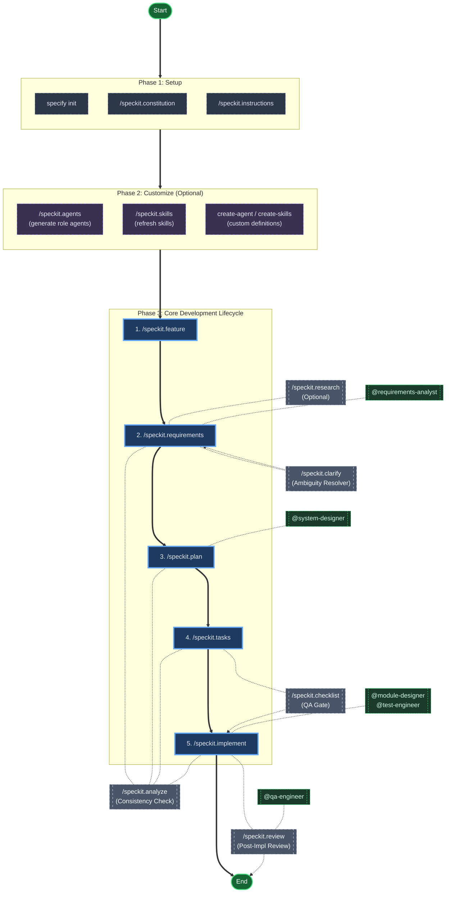

# Quick Start Guide

This guide walks you through the complete Spec Kit workflow in three phases: **Setup**, **Customize**, and **Develop**.

> **Important for Beginners**: Spec Kit involves two distinct types of interactions:
> 1. **Terminal CLI** (`specify ...`): Used for project initialization and configuration. Run these in your system terminal.
> 2. **AI Agent Commands** (`/speckit. ...`): Used for the development workflow. **Type these into your AI Assistant's chat interface (e.g., Copilot Chat), DO NOT run them in your terminal.**

## Phase 1: Setup

### Install and Initialize

Initialize your project with the `specify` CLI:

```bash
uvx --from git+https://github.com/github/spec-kit.git specify init <PROJECT_NAME>
```

Or initialize in the current directory:

```bash
uvx --from git+https://github.com/github/spec-kit.git specify init .
```

Specify your AI assistant explicitly (optional):

```bash
specify init <PROJECT_NAME> --ai claude    # Claude Code (Tier 1)
specify init <PROJECT_NAME> --ai codex    # Codex CLI (Tier 1)
specify init <PROJECT_NAME> --ai qoder    # Qoder CLI (Tier 1)
specify init <PROJECT_NAME> --ai copilot   # GitHub Copilot (Tier 1)
specify init <PROJECT_NAME> --ai opencode  # opencode (Tier 1)
specify init <PROJECT_NAME> --ai qwen     # Qwen Code (Tier 2)
specify init <PROJECT_NAME> --ai hermes   # Hermes Agent (Tier 2)
specify init <PROJECT_NAME> --ai iflow    # iFlow (Tier 2)
```

### What `specify init` Creates

After initialization, your project has a `.specify/` directory with the following structure:

```text
.specify/
├── instructions.md          # AI agent instructions (symlinked to CLAUDE.md, etc.)
├── memory/                  # Project memory (constitution, features, knowledge)
│   ├── constitution.md      # Core principles and governance rules
│   └── features.md          # Feature index
├── templates/               # Spec/plan/task templates
├── scripts/                 # Automation scripts (bash)
├── skills/                  # Installed skills (analysis, draw, create-skills, etc.)
├── agents/                  # Agent workspace (bundled + generated agents)
│   ├── code-reviewer.agent.md  # Pre-installed agent
│   └── references/          # Shared reference materials for agents
└── specs/                   # Feature specifications (created per feature)
```

Symlinks are created for your AI tool:
- `.github/agents/` → `.specify/agents/` (Copilot, Claude Code)
- `.qoder/agents/` → `.specify/agents/` (Qoder)
- `.qwen/agents/` → `.specify/agents/` (Qwen)
- `.hermes/agents/` → `.specify/agents/` (Hermes Agent)
- `.iflow/agents/` → `.specify/agents/` (iFlow)
- `.opencode/agents/` → `.specify/agents/` (opencode)

The same symlink model applies to skills directories.

### Generate Role-Based Agents

After initialization, run `/speckit.agents` (no arguments) to generate six development workflow agents tailored to your project:

```text
/speckit.agents
```

This generates:

| Agent | File | Role |
|-------|------|------|
| Requirements Analyst | `requirements-analyst.agent.md` | Clarifies and structures requirements from stakeholder input |
| System Designer | `system-designer.agent.md` | Designs system-level architecture and implementation approaches |
| Module Designer | `module-designer.agent.md` | Designs detailed implementations within specific modules |
| Test Engineer | `test-engineer.agent.md` | Designs and executes acceptance tests |
| QA Engineer | `qa-engineer.agent.md` | Validates system quality against design and requirements |
| Knowledge Manager | `knowledge-manager.agent.md` | Maintains documentation and project knowledge |

Each agent is populated with your project's actual context (tech stack, directory structure, constitution, features).

---

## Phase 2: Customize (Optional)

You can use the built-in agents and skills as-is, or create custom ones for your project's specific needs.

### Create Custom Agents

Use the `create-agent` skill to define new role-based agent templates:

```text
/create-agent A security auditor who reviews code changes for OWASP vulnerabilities
```

Use the `improve-agent` skill to refine agents based on usage feedback:

```text
/improve-agent The requirements-analyst agent should ask more targeted questions about data privacy
```

### Create Custom Skills

Use the `create-skills` skill to define new reusable workflows:

```text
/create-skills api-testing - Validates API endpoints against OpenAPI specifications
```

Use the `improve-skills` skill to iterate on existing skills:

```text
/improve-skills The draw-plantuml skill should support C4 model diagrams
```

### Pre-installed Skills

Spec Kit ships with these skills ready to use:

- `analysis-project` — Deep architecture analysis reports
- `draw-plantuml` — System architecture diagrams via PlantUML
- `draw-echarts` — Data visualizations via Apache ECharts
- `draw-d3js` — Interactive D3.js visualizations
- `create-skills` / `improve-skills` — Skill lifecycle management
- `create-agent` / `improve-agent` — Agent template lifecycle management
- `think-skills` — Dry-run simulation of skills

---

## Phase 3: Develop

Use the standard Spec Kit development workflow. Agents and skills assist naturally at each stage — they are auxiliary aids, not required dependencies.

### The SDD Workflow

```text
/speckit.feature → /speckit.requirements → /speckit.clarify → /speckit.plan → /speckit.tasks → /speckit.implement → /speckit.review
```

### Step 1: Define Requirements

```text
/speckit.requirements Build a task management app with Kanban boards, drag-and-drop, and user assignment
```

The `@requirements-analyst` agent can help translate business language into structured requirements when you need interactive clarification.

### Step 2: Clarify Ambiguities

```text
/speckit.clarify
```

Resolves `[NEEDS CLARIFICATION]` markers and binds the spec to a Feature.

### Step 3: Create Technical Plan

```text
/speckit.plan Use React with TypeScript, PostgreSQL, and REST APIs
```

The `@system-designer` agent can help evaluate architectural trade-offs from a holistic project perspective.

### Step 4: Break Down into Tasks

```text
/speckit.tasks
```

### Step 5: Implement

```text
/speckit.implement
```

The `@module-designer` and `@test-engineer` agents can assist with module-level design and test-first development during implementation.

### Step 6: Review

```text
/speckit.review
```

The `@qa-engineer` agent can help validate that the implementation satisfies both the architectural design and the original requirements.

---

## Command Overview

The following commands are **prompt instructions** for your AI Agent. For detailed usage, execution flow, and examples, see the individual command documentation linked below.

### Core Development Lifecycle

| Command | Purpose | Details |
|---------|---------|---------|
| `/speckit.requirements` | Create/update requirements specification (WHAT/WHY) | [details →](commands/requirements.md) |
| `/speckit.clarify` | Resolve ambiguous requirements | [details →](commands/clarify.md) |
| `/speckit.plan` | Generate implementation plans (HOW) | [details →](commands/plan.md) |
| `/speckit.tasks` | Break down plans into actionable tasks | [details →](commands/tasks.md) |
| `/speckit.implement` | Implement tasks with validation | [details →](commands/implement.md) |
| `/speckit.review` | Review implementations against specs | [details →](commands/review.md) |

### Quality Assurance & Research

| Command | Purpose | Details |
|---------|---------|---------|
| `/speckit.analyze` | Cross-artifact consistency analysis (read-only) | [details →](commands/analyze.md) |
| `/speckit.checklist` | Generate quality checklists ("unit tests for English") | [details →](commands/checklist.md) |
| `/speckit.research` | Conduct technical research to inform decisions | [details →](commands/research.md) |

### Governance & Extension

| Command | Purpose | Details |
|---------|---------|---------|
| `/speckit.constitution` | Manage project constitution and governance rules | [details →](commands/constitution.md) |
| `/speckit.feature` | Manage feature registry (ID, name, status) | [details →](commands/feature.md) |
| `/speckit.agents` | Generate role-based agents or create custom agents | [details →](commands/agents.md) |
| `/speckit.skills` | Manage specialized skills | [details →](commands/skills.md) |
| `/speckit.tools` | Define/discover reusable tools with behavioral rules | [details →](commands/tools.md) |
| `/speckit.instructions` | Generate AI agent instructions and symlinks | [details →](commands/instructions.md) |

### Command Prerequisites & Next Steps

Commands follow a natural order. The table below shows common prerequisites and next commands:

| Command | Common Prerequisites | Common Next Commands |
|---------|---------------------|---------------------|
| `/speckit.constitution` | Repo available | `/speckit.feature`, `/speckit.requirements` |
| `/speckit.feature` | (Optional) `/speckit.constitution` | `/speckit.requirements` |
| `/speckit.requirements` | (Optional) `/speckit.feature` | `/speckit.clarify`, `/speckit.plan` |
| `/speckit.clarify` | `/speckit.requirements` | `/speckit.plan` |
| `/speckit.research` | `/speckit.requirements` or `/speckit.plan` | `/speckit.plan` |
| `/speckit.plan` | `/speckit.requirements` (clarify done if needed) | `/speckit.tasks`, `/speckit.checklist` |
| `/speckit.tasks` | `/speckit.plan` | `/speckit.analyze`, `/speckit.implement` |
| `/speckit.analyze` | `/speckit.tasks` | Upstream revisions, `/speckit.implement` |
| `/speckit.checklist` | `/speckit.requirements` or `/speckit.plan` | `/speckit.plan`, `/speckit.implement` |
| `/speckit.implement` | `/speckit.tasks` (and checklists completed) | `/speckit.review` |
| `/speckit.review` | `/speckit.implement` | `/speckit.analyze`, upstream iteration |

> **Rule**: If `[NEEDS CLARIFICATION]` markers exist, prioritize `/speckit.clarify`. Before implementation, complete relevant checklists.

---

## Workflow Integration

### Command Execution Flowchart



This flowchart shows three phases with role-based agents as auxiliary aids:

1.  **Phase 1 — Setup**: Run `specify init` to create the `.specify/` structure, then optionally run `/speckit.constitution` and `/speckit.instructions`.
2.  **Phase 2 — Customize (Optional)**: Run `/speckit.agents` to generate role-based agents for your project. Use `create-agent` or `create-skills` to define custom agents or skills. Or skip this phase and use the defaults.
3.  **Phase 3 — Core Development Lifecycle**:
    *   `1. /speckit.feature`: Create/select a feature registry entry.
    *   `2. /speckit.requirements`: Create/update the requirements specification (WHAT/WHY). The `@requirements-analyst` agent can help translate business language.
    *   `3. /speckit.plan`: Create the technical plan. The `@system-designer` agent can help evaluate architectural trade-offs.
    *   `4. /speckit.tasks`: Break down into actionable tasks.
    *   `5. /speckit.implement`: Execute code changes. The `@module-designer` and `@test-engineer` agents can assist with design and testing.
4.  **Auxiliary Tools (Optional)**:
    *   `/speckit.research`: Use during specification if external data is needed.
    *   `/speckit.clarify`: Use if specification has `[NEEDS CLARIFICATION]` tags.
    *   `/speckit.checklist`: Use to generate pre-implementation validation lists.
    *   `/speckit.analyze`: Use at any stage to check for artifact consistency.
    *   `/speckit.review`: Use after implementation to verify against spec/plan. The `@qa-engineer` agent can validate systemic quality.

---

## AI Tool Maintenance Workflows

Each supported AI assistant follows the same lifecycle pattern:

1. Initialize with `specify init <project> --ai <tool>` (or `specify init . --ai <tool>` for existing directories)
2. Verify the tool is available (or use `--ignore-agent-tools` to skip the check)
3. Refresh cross-agent instruction links after template updates by running `/speckit.instructions`
4. Re-run `/speckit.review` before release to verify support remains consistent across assistants

Supported tools (Tier 1): `claude`, `codex`, `qoder`, `copilot`, `opencode`; (Tier 2): `qwen`, `hermes`, `iflow`.

---

## Example: Building Taskify

Here's a complete walkthrough using the three-phase model.

### Phase 1: Setup

```bash
uvx --from git+https://github.com/github/spec-kit.git specify init taskify --ai copilot
```

Then generate role-based agents:

```text
/speckit.agents
```

### Phase 2: Skip (use defaults)

The built-in agents and skills are sufficient for this project.

### Phase 3: Develop

**Define requirements:**

```text
/speckit.requirements Develop Taskify, a team productivity platform with Kanban boards. Users can create projects, add team members, assign tasks, comment, and drag-and-drop tasks between status columns. Start with 5 predefined users (1 PM, 4 engineers), 3 sample projects, standard Kanban columns (To Do, In Progress, In Review, Done). No login required for initial testing.
```

**Refine and clarify:**

```text
For each project, create 5-15 tasks randomly distributed across columns, with at least one task per column.
```

**Generate technical plan:**

```text
/speckit.plan Use .NET Aspire with Postgres, Blazor Server frontend with drag-and-drop, REST APIs for projects, tasks, and notifications.
```

**Break down and implement:**

```text
/speckit.tasks
/speckit.implement
```

**Review:**

```text
/speckit.review
```

---

## Best Practices

- Always run `/speckit.requirements` to establish clear requirements before planning
- Use `/speckit.checklist` before implementation to ensure quality
- Run `/speckit.analyze` regularly to catch inconsistencies early
- Keep specifications focused on WHAT and WHY, not HOW
- Limit clarifications to critical decisions only
- Maintain constitutional compliance throughout the workflow
- Run `/speckit.agents` after `specify init` to generate project-aware role agents
- Use agents as consultants for their role perspective, not as required gatekeepers
- Use `create-agent` and `improve-agent` to evolve agent templates based on real usage feedback
- Use `create-skills` and `improve-skills` to codify workflows you run more than once

## Key Principles

- **Be explicit** about what you're building and why
- **Don't focus on tech stack** during the specification phase
- **Iterate and refine** requirements before implementation
- **Validate** the plan before coding begins
- **Use agents as consultants** — invoke them for their role perspective, not as required gatekeepers
- **Use skills for repeatability** — codify workflows you run more than once

## Further Reading

- [Per-Command Details](commands/) — Detailed execution flow, output artifacts, and examples for every `/speckit.*` command
- [Spec-Driven Development](spec-driven.md) — Methodology deep-dive
- [Installation Guide](installation.md) — Detailed setup options
