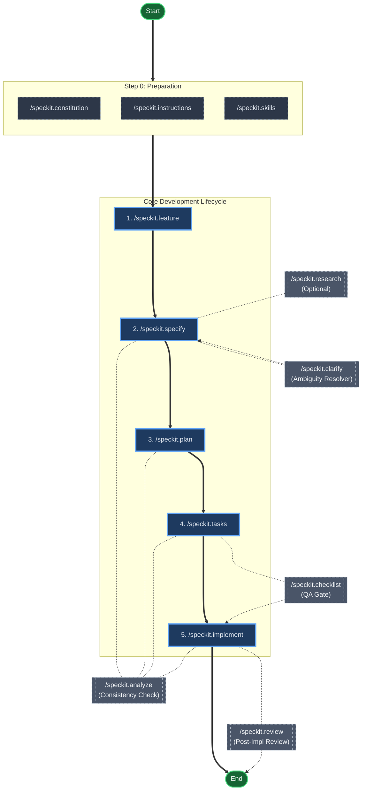

# Spec Kit Usage Guide

Spec Kit is a Specification-Driven Development (SDD) CLI tool that helps developers adopt structured development practices. The tool provides a comprehensive workflow from feature specification to implementation, with built-in quality checks and validation.

> **Important for Beginners**: Spec Kit involves two distinct types of interactions:
> 1. **Terminal CLI** (`specify ...`): Used for project initialization and configuration. Run these in your system terminal.
> 2. **AI Agent Commands** (`/speckit. ...`): Used for the development workflow. **Type these into your AI Assistant's chat interface (e.g., Copilot Chat), DO NOT run them in your terminal.**

## Command Overview

The following commands are **prompt instructions** for your AI Agent. Use them inside your AI chat interface, **not** in your terminal. Spec Kit provides the following core commands:

| Command | Purpose | Typical Workflow Stage |
|---------|---------|----------------------|
| `speckit.specify` | Create detailed feature specifications | Specification |
| `speckit.clarify` | Clarify ambiguous requirements | Specification |
| `speckit.plan` | Generate implementation plans | Planning |
| `speckit.tasks` | Break down plans into actionable tasks | Planning |
| `speckit.implement` | Implement tasks with validation | Implementation |
| `speckit.analyze` | Analyze consistency across artifacts | Quality Assurance |
| `speckit.checklist` | Generate quality checklists | Quality Assurance |
| `speckit.review` | Review implementations against specs | Quality Assurance |
| `speckit.research` | Conduct technical research | Research |
| `speckit.constitution` | Manage project constitution | Governance |
| `speckit.feature` | Manage feature registry | Governance |
| `speckit.skills` | Manage specialized skills | Extension |
| `speckit.instructions` | Generate usage instructions | Documentation |

## Detailed Command Reference

### `speckit.specify`
**Purpose**: Create comprehensive feature specifications that define WHAT needs to be built and WHY, without specifying HOW.

**Usage**: 
```bash
/speckit.specify [feature description]
```

**Key Features**:
- Generates structured specifications with user scenarios, functional requirements, and success criteria
- Automatically creates numbered branches and spec files
- Integrates with feature registry for tracking
- Validates specification quality before proceeding
- Limits clarifications to maximum 3 critical questions

**Output**: Creates a new directory under `.specify/features/` (e.g., `.specify/features/001-login/`) and generates a `spec.md` file within it containing the complete specification.

### `speckit.clarify`
**Purpose**: Resolve ambiguous or unclear requirements in existing specifications.

**Usage**:
```bash
/speckit.clarify [clarification context]
```

**Key Features**:
- Identifies and resolves `[NEEDS CLARIFICATION]` markers in specs
- Presents clear options for user decision
- Updates specifications with resolved requirements
- Maintains specification quality standards

### `speckit.plan`
**Purpose**: Generate detailed implementation plans based on specifications.

**Usage**:
```bash
/speckit.plan [planning preferences or constraints]
```

**Key Features**:
- Translates specifications into technical architecture decisions
- Defines data models, components, and integration points
- Respects constitutional constraints
- Creates phased implementation approach
- Outputs structured `plan.md` file

### `speckit.tasks`
**Purpose**: Break down implementation plans into granular, actionable tasks.

**Usage**:
```bash
/speckit.tasks [task prioritization or constraints]
```

**Key Features**:
- Decomposes plan phases into individual development tasks
- Assigns task priorities and dependencies
- Ensures tasks are implementable and testable
- Generates `tasks.md` file with complete task list

### `speckit.implement`
**Purpose**: Execute implementation tasks with built-in quality validation.

**Usage**:
```bash
/speckit.implement [implementation scope or priority]
```

**Key Features**:
- Implements tasks according to plan and spec
- Validates checklist completion before implementation
- Provides progress tracking and status reporting
- Ensures code quality and adherence to specifications

### `speckit.analyze`
**Purpose**: Identify inconsistencies, duplications, and ambiguities across specification artifacts.

**Usage**:
```bash
/speckit.analyze [analysis focus area]
```

**Key Features**:
- Performs cross-artifact consistency checks (spec, plan, tasks)
- Enforces constitutional compliance
- Generates structured analysis reports
- Identifies critical issues requiring resolution
- **Read-only operation** - does not modify files

### `speckit.checklist`
**Purpose**: Generate quality checklists that serve as "unit tests for English" requirements.

**Usage**:
```bash
/speckit.checklist [checklist type or focus area]
```

**Key Features**:
- Validates requirements quality, clarity, and completeness
- Creates domain-specific checklists (UX, security, testing, etc.)
- Ensures requirements are testable and unambiguous
- Tracks checklist completion status
- Prevents implementation of poorly-defined requirements

### `speckit.review`
**Purpose**: Review implemented features against original specifications and plans.

**Usage**:
```bash
/speckit.review [review criteria or focus areas]
```

**Key Features**:
- Validates implementation against specifications
- Checks for requirement coverage and compliance
- Identifies gaps or deviations from original plan
- Provides comprehensive review reports

### `speckit.research`
**Purpose**: Conduct technical research to inform specification and implementation decisions.

**Usage**:
```bash
/speckit.research [research topic or question]
```

**Key Features**:
- Investigates technical approaches and alternatives
- Evaluates technology choices and trade-offs
- Provides evidence-based recommendations
- Supports informed decision-making

### `speckit.constitution`
**Purpose**: Manage and enforce the project's core principles and governance rules (stored in `memory/constitution.md`).

**Usage**:
```bash
/speckit.constitution [constitutional update or query]
```

**Key Features**:
- Maintains core project principles and constraints in `memory/constitution.md`
- Enforces non-negotiable rules across all artifacts
- Provides constitutional guidance for decision-making
- Tracks constitutional changes and updates

### `speckit.feature`
**Purpose**: Manage the feature registry (stored in `memory/feature-index.md`) and track feature evolution.

**Usage**:
```bash
/speckit.feature [feature management action]
```

**Key Features**:
- Maintains centralized feature index
- Tracks feature status and relationships
- Supports feature lifecycle management
- Ensures consistent feature naming and organization

### `speckit.skills`
**Purpose**: Manage specialized skills and capabilities for extended functionality.

**Usage**:
```bash
/speckit.skills [skill management action]
```

**Key Features**:
- Extends Spec Kit capabilities with domain-specific skills
- Manages skill definitions and implementations
- Supports skill-based workflow customization
- Enables community skill contributions

### `speckit.instructions`
**Purpose**: Generate comprehensive usage instructions, maintenance guides, or system prompts. This command helps create documentation for humans or setup instructions for AI agents.

**Usage**:
```bash
/speckit.instructions [instruction scope or audience]
```

**Key Features**:
- Creates user-friendly documentation
- Generates context-specific instructions
- Supports multiple documentation formats
- Maintains documentation consistency

## Workflow Integration

The Spec Kit workflow consists of a **Core Lifecycle** for standardized development, supported by **Auxiliary Tools** that provide rigorous quality assurance and assistance when needed.

### Command Execution Flowchart



This flowchart distinguishes between the **Core Path** (solid arrows) and **Auxiliary Tools** (dashed lines):

1.  **Preparation**: `/speckit.constitution`, `/speckit.instructions`, `/speckit.skills` (Run once or as needed).
2.  **Core Lifecycle**:
    *   `1. /speckit.feature`: Initialize feature context.
    *   `2. /speckit.specify`: Define the specification.
    *   `3. /speckit.plan`: Create the technical plan.
    *   `4. /speckit.tasks`: Breakdown into tasks.
    *   `5. /speckit.implement`: Execute code changes.
3.  **Auxiliary Tools (Optional)**:
    *   `/speckit.research`: Use during specification if external data is needed.
    *   `/speckit.clarify`: Use if specification has `[NEEDS CLARIFICATION]` tags.
    *   `/speckit.checklist`: Use to generate pre-implementation validation lists.
    *   `/speckit.analyze`: Use at any stage to check for artifact consistency.
    *   `/speckit.review`: Use after implementation to verify against spec/plan.

## Best Practices

- Always run `speckit.specify` first to establish clear requirements
- Use `speckit.checklist` before implementation to ensure quality
- Run `speckit.analyze` regularly to catch inconsistencies early
- Keep specifications focused on WHAT and WHY, not HOW
- Limit clarifications to critical decisions only
- Maintain constitutional compliance throughout the workflow
