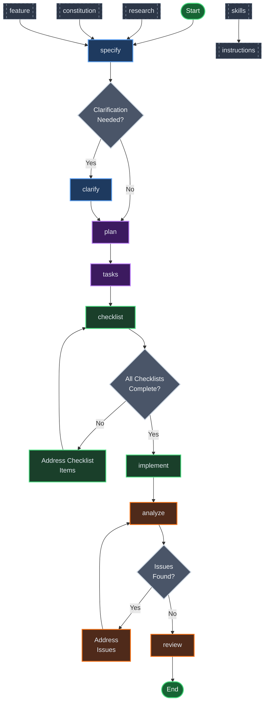

# Spec Kit Usage Guide

Spec Kit is a Specification-Driven Development (SDD) CLI tool that helps developers adopt structured development practices. The tool provides a comprehensive workflow from feature specification to implementation, with built-in quality checks and validation.

## Command Overview

Spec Kit provides the following core commands, each designed to support a specific phase of the SDD workflow:

| Command | Purpose | Typical Workflow Stage |
|---------|---------|----------------------|
| `speckit.specify` | Create detailed feature specifications | Specification |
| `speckit.clarify` | Clarify ambiguous requirements | Specification |
| `speckit.plan` | Generate implementation plans | Planning |
| `speckit.tasks` | Break down plans into actionable tasks | Planning |
| `speckit.implement` | Implement tasks with validation | Implementation |
| `speckit.analyze` | Analyze consistency across artifacts | Quality Assurance |
| `speckit.checklist` | Generate quality checklists | Quality Assurance |
| `speckit.review` | Review implementations against specs | Quality Assurance |
| `speckit.research` | Conduct technical research | Research |
| `speckit.constitution` | Manage project constitution | Governance |
| `speckit.feature` | Manage feature registry | Governance |
| `speckit.skills` | Manage specialized skills | Extension |
| `speckit.instructions` | Generate usage instructions | Documentation |

## Detailed Command Reference

### `speckit.specify`
**Purpose**: Create comprehensive feature specifications that define WHAT needs to be built and WHY, without specifying HOW.

**Usage**: 
```bash
/speckit.specify [feature description]
```

**Key Features**:
- Generates structured specifications with user scenarios, functional requirements, and success criteria
- Automatically creates numbered branches and spec files
- Integrates with feature registry for tracking
- Validates specification quality before proceeding
- Limits clarifications to maximum 3 critical questions

**Output**: Creates `spec.md` file in feature directory with complete specification.

### `speckit.clarify`
**Purpose**: Resolve ambiguous or unclear requirements in existing specifications.

**Usage**:
```bash
/speckit.clarify [clarification context]
```

**Key Features**:
- Identifies and resolves `[NEEDS CLARIFICATION]` markers in specs
- Presents clear options for user decision
- Updates specifications with resolved requirements
- Maintains specification quality standards

### `speckit.plan`
**Purpose**: Generate detailed implementation plans based on specifications.

**Usage**:
```bash
/speckit.plan [planning preferences or constraints]
```

**Key Features**:
- Translates specifications into technical architecture decisions
- Defines data models, components, and integration points
- Respects constitutional constraints
- Creates phased implementation approach
- Outputs structured `plan.md` file

### `speckit.tasks`
**Purpose**: Break down implementation plans into granular, actionable tasks.

**Usage**:
```bash
/speckit.tasks [task prioritization or constraints]
```

**Key Features**:
- Decomposes plan phases into individual development tasks
- Assigns task priorities and dependencies
- Ensures tasks are implementable and testable
- Generates `tasks.md` file with complete task list

### `speckit.implement`
**Purpose**: Execute implementation tasks with built-in quality validation.

**Usage**:
```bash
/speckit.implement [implementation scope or priority]
```

**Key Features**:
- Implements tasks according to plan and spec
- Validates checklist completion before implementation
- Provides progress tracking and status reporting
- Ensures code quality and adherence to specifications

### `speckit.analyze`
**Purpose**: Identify inconsistencies, duplications, and ambiguities across specification artifacts.

**Usage**:
```bash
/speckit.analyze [analysis focus area]
```

**Key Features**:
- Performs cross-artifact consistency checks (spec, plan, tasks)
- Enforces constitutional compliance
- Generates structured analysis reports
- Identifies critical issues requiring resolution
- **Read-only operation** - does not modify files

### `speckit.checklist`
**Purpose**: Generate quality checklists that serve as "unit tests for English" requirements.

**Usage**:
```bash
/speckit.checklist [checklist type or focus area]
```

**Key Features**:
- Validates requirements quality, clarity, and completeness
- Creates domain-specific checklists (UX, security, testing, etc.)
- Ensures requirements are testable and unambiguous
- Tracks checklist completion status
- Prevents implementation of poorly-defined requirements

### `speckit.review`
**Purpose**: Review implemented features against original specifications and plans.

**Usage**:
```bash
/speckit.review [review criteria or focus areas]
```

**Key Features**:
- Validates implementation against specifications
- Checks for requirement coverage and compliance
- Identifies gaps or deviations from original plan
- Provides comprehensive review reports

### `speckit.research`
**Purpose**: Conduct technical research to inform specification and implementation decisions.

**Usage**:
```bash
/speckit.research [research topic or question]
```

**Key Features**:
- Investigates technical approaches and alternatives
- Evaluates technology choices and trade-offs
- Provides evidence-based recommendations
- Supports informed decision-making

### `speckit.constitution`
**Purpose**: Manage and enforce the project's core principles and governance rules.

**Usage**:
```bash
/speckit.constitution [constitutional update or query]
```

**Key Features**:
- Maintains core project principles and constraints
- Enforces non-negotiable rules across all artifacts
- Provides constitutional guidance for decision-making
- Tracks constitutional changes and updates

### `speckit.feature`
**Purpose**: Manage the feature registry and track feature evolution.

**Usage**:
```bash
/speckit.feature [feature management action]
```

**Key Features**:
- Maintains centralized feature index
- Tracks feature status and relationships
- Supports feature lifecycle management
- Ensures consistent feature naming and organization

### `speckit.skills`
**Purpose**: Manage specialized skills and capabilities for extended functionality.

**Usage**:
```bash
/speckit.skills [skill management action]
```

**Key Features**:
- Extends Spec Kit capabilities with domain-specific skills
- Manages skill definitions and implementations
- Supports skill-based workflow customization
- Enables community skill contributions

### `speckit.instructions`
**Purpose**: Generate comprehensive usage instructions and documentation.

**Usage**:
```bash
/speckit.instructions [instruction scope or audience]
```

**Key Features**:
- Creates user-friendly documentation
- Generates context-specific instructions
- Supports multiple documentation formats
- Maintains documentation consistency

## Workflow Integration

The Spec Kit commands are designed to work together in a cohesive workflow:

1. **Specification Phase**: `specify` → `clarify`
2. **Planning Phase**: `plan` → `tasks`
3. **Implementation Phase**: `implement`
4. **Quality Assurance Phase**: `analyze` → `checklist` → `review`
5. **Research & Governance**: `research` → `constitution` → `feature`
6. **Extension & Documentation**: `skills` → `instructions`

Each command validates prerequisites and ensures proper sequencing, preventing workflow violations and maintaining artifact consistency.

### Command Execution Flowchart



This flowchart illustrates the primary execution sequence of Spec Kit commands, with dark theme optimized styling:

- **Green circles**: Start and End points (dark green background with white text)
- **Dark blue rectangles**: Specification Phase (`specify`, `clarify`) with light text
- **Dark purple rectangles**: Planning Phase (`plan`, `tasks`) with light text  
- **Dark green rectangles**: Implementation Phase (`checklist`, `implement`) with light text
- **Dark orange rectangles**: Quality Assurance Phase (`analyze`, `review`) with light text
- **Dark gray dashed rectangles**: Support Commands (`research`, `constitution`, `feature`, `skills`, `instructions`)
- **Light gray diamonds**: Decision points with white text for better contrast
- **Styled arrows**: Clear flow direction with appropriate color contrast

The dark theme styling uses deeper background colors with light text to ensure excellent readability in dark IDE environments while maintaining the visual distinction between different workflow phases.

## Best Practices

- Always run `speckit.specify` first to establish clear requirements
- Use `speckit.checklist` before implementation to ensure quality
- Run `speckit.analyze` regularly to catch inconsistencies early
- Keep specifications focused on WHAT and WHY, not HOW
- Limit clarifications to critical decisions only
- Maintain constitutional compliance throughout the workflow
