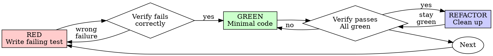

# test-driven-development

> **Status: draft** — adapted from superpowers (skills/test-driven-development). Incubating in draft/; complements the master's Test-First constitution principle but is not wired into the main /speckit.* flow.

## Overview

Write the test first. Watch it fail. Write minimal code to pass.

**Core principle:** If you didn't watch the test fail, you don't know if it tests the right thing.

**Violating the letter of the rules is violating the spirit of the rules.**

### When to use

| Situation | Apply TDD? |
|-----------|-----------|
| New features | **Always** |
| Bug fixes | **Always** |
| Refactoring | **Always** |
| Behavior changes | **Always** |
| Throwaway prototypes | Ask your human partner |
| Generated code | Ask your human partner |
| Configuration files | Ask your human partner |

Thinking "skip TDD just this once"? Stop. That's rationalization.

## The Iron Law

```
NO PRODUCTION CODE WITHOUT A FAILING TEST FIRST
```

Write code before the test? Delete it. Start over.

**No exceptions:**
- Don't keep it as "reference"
- Don't "adapt" it while writing tests
- Don't look at it
- Delete means delete

Implement fresh from tests. Period.

## The cycle



The loop, in order: **RED → verify-RED → GREEN → verify-GREEN → REFACTOR → (next)**. Never skip a verify step.

### RED — write failing test

Write one minimal test showing what should happen.

<Good>

```typescript
test('retries failed operations 3 times', async () => {
  let attempts = 0;
  const operation = () => {
    attempts++;
    if (attempts < 3) throw new Error('fail');
    return 'success';
  };

  const result = await retryOperation(operation);

  expect(result).toBe('success');
  expect(attempts).toBe(3);
});
```

Clear name, tests real behavior, one thing

</Good>

<Bad>

```typescript
test('retry works', async () => {
  const mock = jest.fn()
    .mockRejectedValueOnce(new Error())
    .mockRejectedValueOnce(new Error())
    .mockResolvedValueOnce('success');
  await retryOperation(mock);
  expect(mock).toHaveBeenCalledTimes(3);
});
```

Vague name, tests mock not code

</Bad>

**Requirements:**
- One behavior
- Clear name
- Real code (no mocks unless unavoidable)

### Verify RED — watch it fail

> **MANDATORY. Never skip.**

```bash
npm test path/to/test.test.ts
```

Confirm:
- Test fails (not errors)
- Failure message is expected
- Fails because feature missing (not typos)

| Symptom | Meaning | Action |
|---------|---------|--------|
| Test passes | You're testing existing behavior | Fix the test |
| Test errors | Typo/setup problem, not a real failure | Fix error, re-run until it fails correctly |

### GREEN — minimal code

Write the simplest code to pass the test.

<Good>

```typescript
async function retryOperation<T>(fn: () => Promise<T>): Promise<T> {
  for (let i = 0; i < 3; i++) {
    try {
      return await fn();
    } catch (e) {
      if (i === 2) throw e;
    }
  }
  throw new Error('unreachable');
}
```

Just enough to pass

</Good>

<Bad>

```typescript
async function retryOperation<T>(
  fn: () => Promise<T>,
  options?: {
    maxRetries?: number;
    backoff?: 'linear' | 'exponential';
    onRetry?: (attempt: number) => void;
  }
): Promise<T> {
  // YAGNI
}
```

Over-engineered

</Bad>

Don't add features, refactor other code, or "improve" beyond the test.

### Verify GREEN — watch it pass

> **MANDATORY.**

```bash
npm test path/to/test.test.ts
```

Confirm:
- Test passes
- Other tests still pass
- Output pristine (no errors, warnings)

| Symptom | Action |
|---------|--------|
| Test fails | Fix the code, **not** the test |
| Other tests fail | Fix now |

### REFACTOR — clean up

After green only:
- Remove duplication
- Improve names
- Extract helpers

Keep tests green. Don't add behavior. Then write the next failing test for the next feature.

## Good tests

| Quality | Good | Bad |
|---------|------|-----|
| **Minimal** | One thing. "and" in name? Split it. | `test('validates email and domain and whitespace')` |
| **Clear** | Name describes behavior | `test('test1')` |
| **Shows intent** | Demonstrates desired API | Obscures what code should do |

## Why order matters

> **"I'll write tests after to verify it works"**

Tests written after code pass immediately. Passing immediately proves nothing: might test the wrong thing, might test implementation not behavior, might miss edge cases you forgot, you never saw it catch the bug. Test-first forces you to see the test fail, proving it actually tests something.

> **"I already manually tested all the edge cases"**

Manual testing is ad-hoc. No record of what you tested, can't re-run when code changes, easy to forget cases under pressure. "It worked when I tried it" ≠ comprehensive. Automated tests are systematic — they run the same way every time.

> **"Deleting X hours of work is wasteful"**

Sunk cost fallacy. The time is already gone. The "waste" is keeping code you can't trust. Working code without real tests is technical debt.

> **"Tests after achieve the same goals — it's spirit not ritual"**

No. Tests-after answer "What does this do?" Tests-first answer "What should this do?" Tests-after are biased by your implementation — you test what you built, not what's required. 30 minutes of tests after ≠ TDD.

## Common rationalizations

| Excuse | Reality |
|--------|---------|
| "Too simple to test" | Simple code breaks. Test takes 30 seconds. |
| "I'll test after" | Tests passing immediately prove nothing. |
| "Tests after achieve same goals" | Tests-after = "what does this do?" Tests-first = "what should this do?" |
| "Already manually tested" | Ad-hoc ≠ systematic. No record, can't re-run. |
| "Deleting X hours is wasteful" | Sunk cost fallacy. Keeping unverified code is technical debt. |
| "Keep as reference, write tests first" | You'll adapt it. That's testing after. Delete means delete. |
| "Need to explore first" | Fine. Throw away exploration, start with TDD. |
| "Test hard = design unclear" | Listen to the test. Hard to test = hard to use. |
| "TDD will slow me down" | TDD faster than debugging. Pragmatic = test-first. |
| "Manual test faster" | Manual doesn't prove edge cases. You'll re-test every change. |
| "Existing code has no tests" | You're improving it. Add tests for existing code. |

## Red flags — STOP

STOP and start over the moment you notice any of these:

- Code before test
- Test after implementation
- Test passes immediately
- Can't explain why test failed
- Tests added "later"
- Rationalizing "just this once"
- "I already manually tested it"
- "Tests after achieve the same purpose"
- "It's about spirit not ritual"
- "Keep as reference" or "adapt existing code"
- "Already spent X hours, deleting is wasteful"
- "TDD is dogmatic, I'm being pragmatic"
- "This is different because..."

**All of these mean: Delete code. Start over with TDD.**

## Example: bug fix

**Bug:** Empty email accepted.

**RED**

```typescript
test('rejects empty email', async () => {
  const result = await submitForm({ email: '' });
  expect(result.error).toBe('Email required');
});
```

**Verify RED**

```bash
$ npm test
FAIL: expected 'Email required', got undefined
```

**GREEN**

```typescript
function submitForm(data: FormData) {
  if (!data.email?.trim()) {
    return { error: 'Email required' };
  }
  // ...
}
```

**Verify GREEN**

```bash
$ npm test
PASS
```

**REFACTOR** — extract validation for multiple fields if needed.

## Verification checklist

Before marking work complete:

- [ ] Every new function/method has a test
- [ ] Watched each test fail before implementing
- [ ] Each test failed for the expected reason (feature missing, not typo)
- [ ] Wrote minimal code to pass each test
- [ ] All tests pass
- [ ] Output pristine (no errors, warnings)
- [ ] Tests use real code (mocks only if unavoidable)
- [ ] Edge cases and errors covered

Can't check all boxes? You skipped TDD. Start over.

## When stuck

| Problem | Solution |
|---------|----------|
| Don't know how to test | Write the wished-for API. Write the assertion first. Ask your human partner. |
| Test too complicated | Design too complicated. Simplify the interface. |
| Must mock everything | Code too coupled. Use dependency injection. |
| Test setup huge | Extract helpers. Still complex? Simplify the design. |

## Final rule

```
Production code → test exists and failed first
Otherwise → not TDD
```

No exceptions without your human partner's permission.

## Resources

### References (`./references/`)
- [`testing-anti-patterns.md`](./references/testing-anti-patterns.md) — read when writing or changing tests, adding mocks, or tempted to add test-only methods to production code: testing mock behavior, test-only methods in production, mocking without understanding, incomplete mocks, and integration tests as an afterthought.
